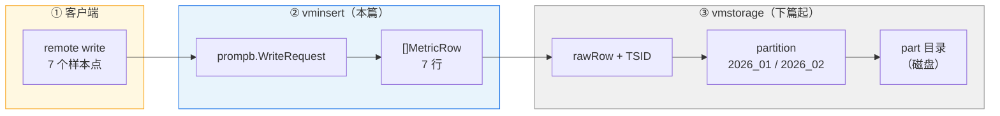
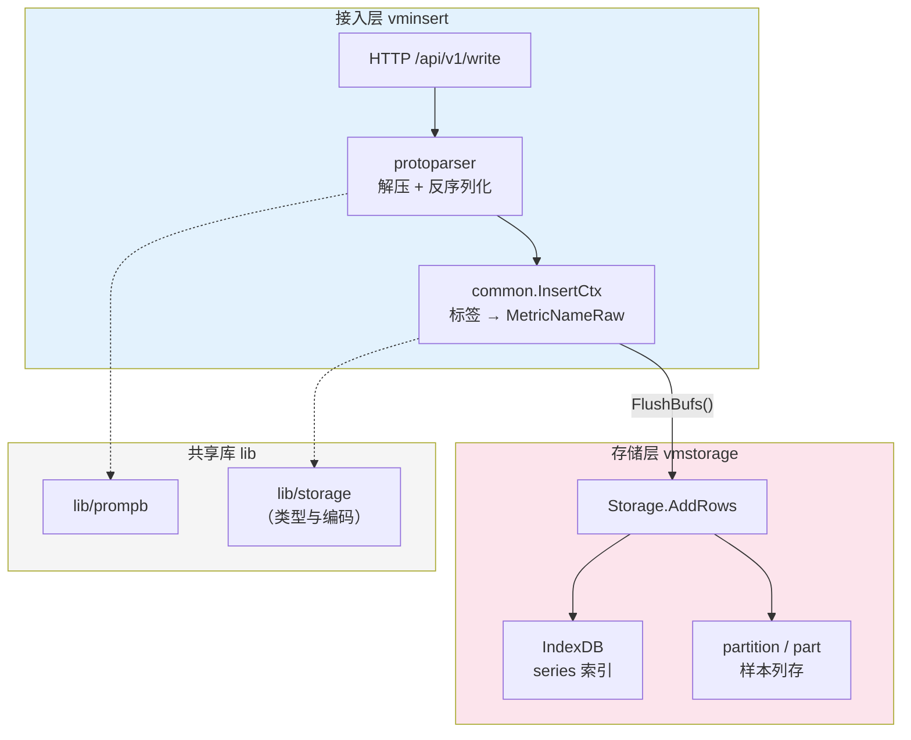
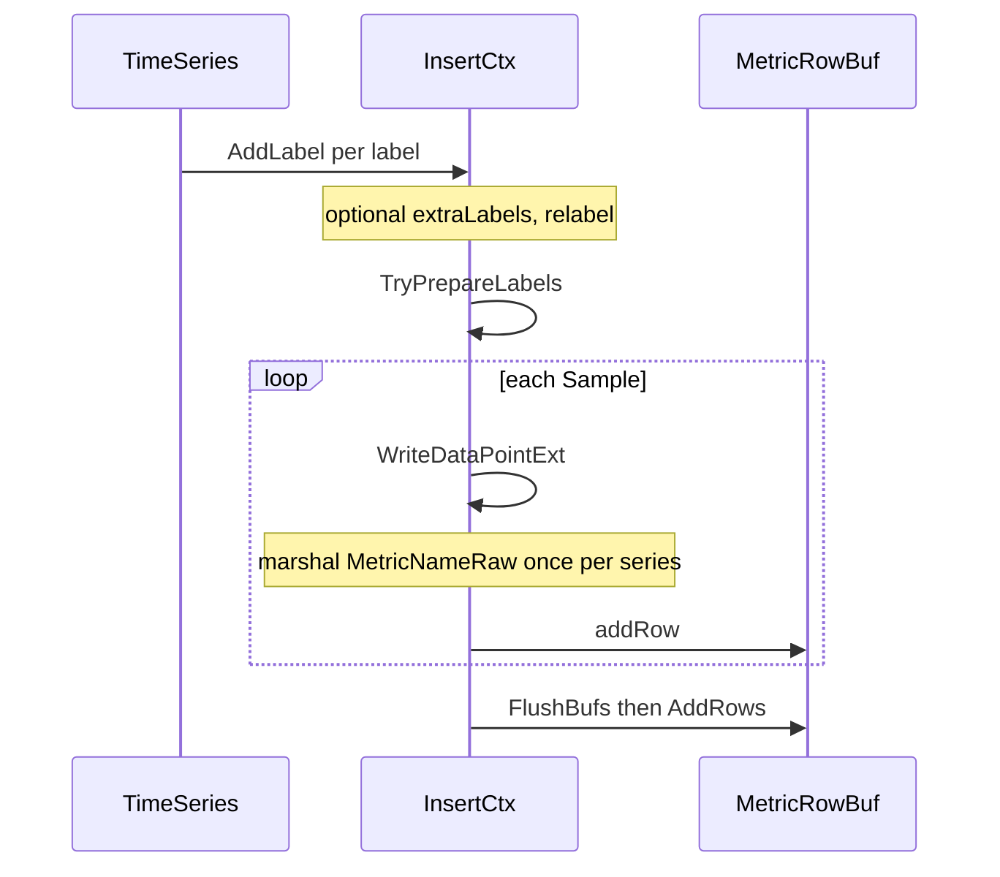
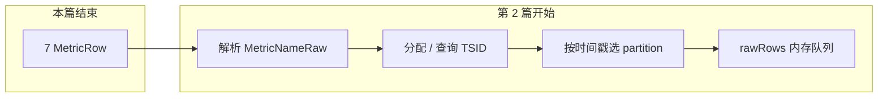

# VictoriaMetrics 写入源码解析（一）：导读与 vminsert 接入层

> **系列索引**：[README.md](./README.md)（贯穿示例、全系列目录）
> **系列说明**：本系列只讲**数据写入**路径（以 Prometheus remote write 为主）。查询、instant rollup、后台 merge 等放在后续篇章。
> **本篇边界**：从 HTTP 请求进入 vminsert，到调用 `vmstorage.AddRows` 为止；**不展开** vmstorage 内部的 partition / part / 磁盘文件。

> **图表预览**：文中使用 [Mermaid](https://mermaid.js.org/) 绘图。VS Code / Cursor 需安装扩展 [Markdown Preview Mermaid Support](https://marketplace.visualstudio.com/items?itemName=bierner.markdown-mermaid) 后使用「Markdown: Open Preview」；GitHub 网页直接打开本文件即可渲染。

---

## 1. 本篇要回答的问题

| 问题 | 本篇是否覆盖 |
|------|----------------|
| 客户端发来的 labels、指标名、时间戳在代码里长什么样？ | ✅ |
| vminsert 和 vmstorage 的职责分界线在哪？ | ✅ |
| `MetricRow` 是怎么从 `WriteRequest` 变出来的？ | ✅ |
| 数据何时写入磁盘、partition 如何划分？ | ❌ 见第 2～4 篇 |

---

## 2. 贯穿全系列的示例数据

下面用**同一条业务故事**贯穿系列（完整表格见 [系列索引](./README.md#贯穿示例全系列统一)）：一个 API 服务在 **2026-01-15** 与 **2026-02-03** 上报监控，包含 **3 条 series**、**7 个样本点**。

### 2.1 逻辑上的时间序列（3 条 series）

在 Prometheus 语义里，**指标名 + 全部 labels** 唯一确定一条 series：

| Series ID | PromQL 形态 | 说明 |
|-----------|-------------|------|
| **S1** | `cpu_usage{host="h1",job="api"}` | 主机 h1 CPU |
| **S2** | `cpu_usage{host="h2",job="api"}` | 主机 h2 CPU |
| **S3** | `http_requests_total{host="h1",path="/x"}` | h1 某路径请求 counter |

> **注意**：S1 与 S2 指标名相同，但 labels 不同 → 在 VM 里是**两条不同的 series**，对应两个 TSID（第 2 篇展开）。

### 2.2 样本点（一次 remote write 请求内）

假设客户端在 **2026-01-15 10:00～10:02（UTC）** 发来一批点，又在 **2026-02-03 08:00** 补发一个点：

| # | Series | 时间（UTC） | 时间戳（ms） | 值 | 写入后归属（vmstorage） |
|---|--------|-------------|--------------|-----|------------------------------|
| 1 | S1 | 2026-01-15 10:00:00 | `1768471200000` | `0.72` | partition `2026_01` |
| 2 | S1 | 2026-01-15 10:01:00 | `1768471260000` | `0.75` | partition `2026_01` |
| 3 | S2 | 2026-01-15 10:00:00 | `1768471200000` | `0.81` | partition `2026_01` |
| 4 | S2 | 2026-01-15 10:02:00 | `1768471320000` | `0.79` | partition `2026_01` |
| 5 | S3 | 2026-01-15 10:00:00 | `1768471200000` | `1200` | partition `2026_01` |
| 6 | S3 | 2026-01-15 10:01:30 | `1768471290000` | `1248` | partition `2026_01` |
| 7 | S1 | 2026-02-03 08:00:00 | `1770105600000` | `0.65` | partition **`2026_02`**（跨月） |

**跨月**：#7 与 #1～#6 的 **series 相同（S1）**，但时间戳落在 2 月 → vmstorage 会路由到**另一个按月 partition**（`timestampToPartitionName` → `2006_01` 格式，第 2 篇详解）。

### 2.3 在 Prometheus remote write 里的打包形态

一次 HTTP POST 对应一个 `prompb.WriteRequest`，内部是 **多条 `TimeSeries`**，每条带 **Labels + Samples**：

```text
WriteRequest
├── Timeseries[0]  → S1: __name__, host, job + Samples[#1,#2]
├── Timeseries[1]  → S2: __name__, host, job + Samples[#3,#4]
├── Timeseries[2]  → S3: __name__, host, path + Samples[#5,#6]
└── Timeseries[3]  → S1: 同上 + Samples[#7]   // 可与 [0] 合并或分两次请求
```

实际客户端可能把 S1 的两个时间点放在**同一条** `TimeSeries` 里（多个 `Sample`），也可能拆成两次请求；vminsert **按 sample 展开**处理，语义一致。

### 2.4 示例数据在「模块边界」上的落脚点（本篇 vs 下篇）



| 阶段 | 数据结构 | 是否已有 TSID | 是否已有磁盘 part |
|------|----------|---------------|-------------------|
| ② vminsert 出口 | `MetricRow{MetricNameRaw, Timestamp, Value}` | ❌ | ❌ |
| ③ vmstorage 入口之后 | `rawRow{TSID, Timestamp, Value, ...}` | ✅ | ❌（先内存，后 flush） |

---

## 3. 模块层次与职责边界

VictoriaMetrics 单机（`vmsingle`）可粗分为三层；**Cluster** 下 vminsert 与 vmstorage 进程分离，但 **vminsert 内逻辑相同**，存储侧 API 仍为 `vmstorage.AddRows`。



### 3.1 边界约定（后续篇章沿用）

| 模块 | 目录前缀 | 负责 | 不负责 |
|------|----------|------|--------|
| **vminsert** | `app/vminsert/` | 协议解析、relabel、流式聚合入口、组装 `MetricRow`、调用存储 API | TSID 分配、partition、刷盘 |
| **vmstorage** | `app/vmstorage/` + `lib/storage/` | TSID/IndexDB、按月分区、rawRows 缓冲、part/block、merge | HTTP、Prometheus 文本解析 |
| **protoparser** | `lib/protoparser/` | 各协议解包（本篇：promremotewrite） | 业务存储 |
| **prompb** | `lib/prompb/` | remote write 内存模型 | 持久化 |

**本篇代码阅读范围**（建议开 IDE 对照）：

```text
app/vminsert/main.go                          # 路由到 promremotewrite
app/vminsert/promremotewrite/request_handler.go
app/vminsert/common/insert_ctx.go
lib/protoparser/promremotewrite/stream/streamparser.go
lib/prompb/prompb.go
lib/storage/metric_name.go                    # MarshalMetricNameRaw（仅编码规则）
```

---

## 4. 请求入口：从 URL 到 InsertHandler

单机模式下，Prometheus remote write 命中：

```168:178:app/vminsert/main.go
	case "/prometheus/api/v1/write", "/api/v1/write", "/api/v1/push", "/prometheus/api/v1/push":
		// ...
		prometheusWriteRequests.Inc()
		if err := promremotewrite.InsertHandler(r); err != nil {
			// ...
		}
		w.WriteHeader(http.StatusNoContent)
```

**边界**：`main.go` 只做路由与计数；**不写存储**。

---

## 5. 协议层：解压与 `WriteRequest`

`InsertHandler` 将 body 交给 `stream.Parse`：

```22:31:app/vminsert/promremotewrite/request_handler.go
func InsertHandler(req *http.Request) error {
	extraLabels, err := protoparserutil.GetExtraLabels(req)
	// ...
	return stream.Parse(req.Body, isVMRemoteWrite, func(tss []prompb.TimeSeries, mms []prompb.MetricMetadata) error {
		return insertRows(tss, mms, extraLabels)
	})
}
```

`lib/prompb` 中与示例对应的结构：

```9:40:lib/prompb/prompb.go
type WriteRequest struct {
	Timeseries []TimeSeries
	Metadata   []MetricMetadata
}

type TimeSeries struct {
	Labels  []Label
	Samples []Sample
}

type Sample struct {
	Value     float64
	Timestamp int64   // 毫秒级 Unix 时间戳
}
```

### 5.1 图解：示例 #1 在结构体中的位置

```text
TimeSeries (S1)
┌─────────────────────────────────────────────────────────┐
│ Labels:                                                  │
│   {Name: "__name__", Value: "cpu_usage"}                 │
│   {Name: "host",     Value: "h1"}                        │
│   {Name: "job",      Value: "api"}                       │
├─────────────────────────────────────────────────────────┤
│ Samples:                                                 │
│   {Value: 0.72, Timestamp: 1768471200000}  ← 示例 #1     │
│   {Value: 0.75, Timestamp: 1768471260000}  ← 示例 #2     │
└─────────────────────────────────────────────────────────┘
```

**模块边界**：`stream.Parse` 结束后得到的是 **内存中的 Go 结构体**，尚未进入 VM 存储引擎。

---

## 6. insertRows：labels → MetricRow（本篇核心）

`insertRows` 对**每个 `TimeSeries`、每个 `Sample`** 生成存储层可接受的行。

### 6.1 流程图



（若上图仍无法显示，等价步骤：`TimeSeries` → `AddLabel`（含 extraLabels / relabel）→ `TryPrepareLabels` → 对每个 `Sample` 调用 `WriteDataPointExt`（同 series 只编码一次 `MetricNameRaw`）→ `addRow` 写入缓冲 → `FlushBufs` 调用 `vmstorage.AddRows`。）

### 6.2 标签如何进入 ctx

```48:56:app/vminsert/promremotewrite/request_handler.go
		ctx.Labels = ctx.Labels[:0]
		srcLabels := ts.Labels
		for _, srcLabel := range srcLabels {
			ctx.AddLabel(srcLabel.Name, srcLabel.Value)
		}
		for j := range extraLabels {
			label := &extraLabels[j]
			ctx.AddLabel(label.Name, label.Value)
		}
```

- **维度字段**在接入层就是普通的 **labels**（`host`、`job`、`region`、`path` 等）。
- HTTP 上可通过配置注入 **extraLabels**（多租户、集群环境常见），与客户端 labels 合并后再编码。

### 6.3 指标名：`__name__` → `MetricNameRaw`

`WriteDataPointExt` 第一次为某个 label 组合调用时，会执行 `MarshalMetricNameRaw`：

```143:148:app/vminsert/common/insert_ctx.go
func (ctx *InsertCtx) WriteDataPointExt(metricNameRaw []byte, labels []prompb.Label, timestamp int64, value float64) ([]byte, error) {
	if len(metricNameRaw) == 0 {
		metricNameRaw = ctx.marshalMetricNameRaw(nil, labels)
	}
	err := ctx.addRow(metricNameRaw, timestamp, value)
	return metricNameRaw, err
}
```

编码规则（`__name__` 的 value 作为 **metric group**，其余为 tag）：

```475:492:lib/storage/metric_name.go
		if string(label.Name) == "__name__" {
			label.Name = label.Name[:0]
		}
		// ...
		dst = marshalStringFast(dst, label.Name)
		dst = marshalStringFast(dst, label.Value)
```

**示例 S1** 逻辑上编码为：

```text
MetricNameRaw ≈ [空 key → "cpu_usage"][host → h1][job → api]
```

**示例 S3** 多两个 tag，对应**另一段** `MetricNameRaw` → 另一条 series。

同一 `TimeSeries` 内多个 `Sample` **共享**同一份 `metricNameRaw` 字节切片（`WriteDataPointExt` 返回值复用），减少重复编码。

### 6.4 生成 MetricRow

```151:162:app/vminsert/common/insert_ctx.go
func (ctx *InsertCtx) addRow(metricNameRaw []byte, timestamp int64, value float64) error {
	// ...
	mr.MetricNameRaw = metricNameRaw
	mr.Timestamp = timestamp
	mr.Value = value
```

对本系列示例，**一次 `insertRows` 结束前应得到 7 行 `MetricRow`**（与上表 #1～#7 一一对应）。

### 6.5 表格：示例行在 vminsert 出口的形态

| # | MetricNameRaw（逻辑） | Timestamp | Value |
|---|------------------------|-----------|-------|
| 1 | `cpu_usage` + host=h1, job=api | 1768471200000 | 0.72 |
| 2 | 同上 | 1768471260000 | 0.75 |
| 3 | `cpu_usage` + host=h2, job=api | 1768471200000 | 0.81 |
| 4 | 同上 | 1768471320000 | 0.79 |
| 5 | `http_requests_total` + host=h1, path=/x | 1768471200000 | 1200 |
| 6 | 同上 | 1768471290000 | 1248 |
| 7 | 同 #1（S1） | 1770105600000 | 0.65 |

> **本篇终点**：每一行都是 `{MetricNameRaw, Timestamp, Value}`，**还没有 TSID**，也**不知道**会进 `2026_01` 还是 `2026_02`。

---

## 7. 跨入 vmstorage：`FlushBufs`

```264:281:app/vminsert/common/insert_ctx.go
func (ctx *InsertCtx) FlushBufs() error {
	// 可选：stream aggregation / dedup 预处理
	// ...
	err := vmstorage.AddRows(ctx.mrs)
	ctx.Reset(0)
```

**模块边界**：

| 调用方 | 被调用方 | 契约 |
|--------|----------|------|
| vminsert | `vmstorage.AddRows([]MetricRow)` | 批量行；每行毫秒时间戳 + 浮点值 + 原始 metric 名 |

vminsert **到此为止**；partition 选择、IndexDB、rawRows、part 文件均在 **vmstorage / lib/storage** 内完成（第 2 篇起）。



---

## 8. 与 Prometheus 概念的对照

| Prometheus 概念 | 本篇对应代码 |
|-----------------|--------------|
| 一条 series | 一组唯一 labels + `__name__` → 一次 `MetricNameRaw` |
| 一个 sample | 一个 `Sample` → 一行 `MetricRow` |
| remote write 一批数据 | 一个 `WriteRequest` → 一次 `insertRows` → 一次 `FlushBufs` |
| 标签 `host`、`job` | `prompb.Label` → `InsertCtx.AddLabel` |

---

## 9. 本篇小结

1. **示例**：3 条 series、7 个样本点，其中 6 个落在 `2026_01`、1 个落在 `2026_02`（跨月）。
2. **vminsert 职责**：协议解析 → labels/指标名编码为 `MetricNameRaw` → 展开为 `MetricRow` → `vmstorage.AddRows`。
3. **后续篇章讲解**：TSID、按月 partition、内存 rawRows、磁盘 part（5 个文件）等存储层细节，见第 2～4 篇。

---

## 10. 下篇预告

**第 2 篇**：[02-vmstorage-addrows-tsid.md](./02-vmstorage-addrows-tsid.md) — `AddRows`、TSID 与 IndexDB、按月 partition 路由

将用同一批 7 行 `MetricRow` 说明：

- S1/S2/S3 如何变成 3 个 TSID；
- #7 为何进入 `2026_02`；
- 为何此时仍**不会**立刻生成磁盘 part 目录。

---

## 附录 A：系列目录

完整索引与贯穿示例：[README.md](./README.md)

| 篇 | 标题 | 边界 |
|----|------|------|
| **1（本篇）** | 导读 + vminsert 接入层 | HTTP → `MetricRow` |
| [2](./02-vmstorage-addrows-tsid.md) | AddRows 与 TSID / IndexDB | `MetricRow` → `rawRow` + partition 路由 |
| [3](./03-rawrows-flush-inmemory-part.md) | rawRows 与 flush | 内存缓冲 → inmemory part |
| [4](./04-part-block-disk.md) | part / block 与磁盘 | 5 个文件、落盘、merge |
| 5 | 写入参数与 FAQ | flags、并发、误区 |

---

## 附录 B：推荐阅读顺序

1. 打开示例表格（§2.2），记住 3 条 series、7 个点。
2. 对照 §6 流程图阅读 `request_handler.go` → `insert_ctx.go`。
3. `lib/storage/storage.go` 的 `add()` 等存储层逻辑，见第 2 篇。
