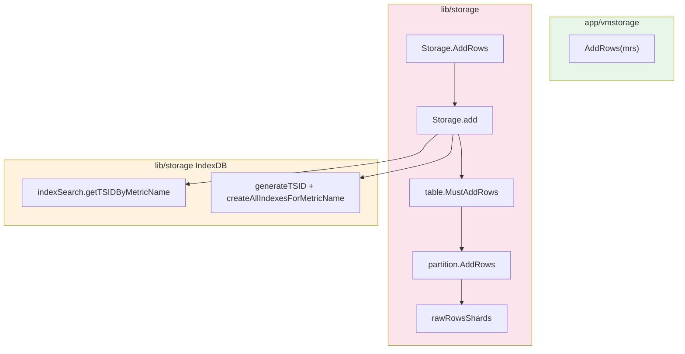
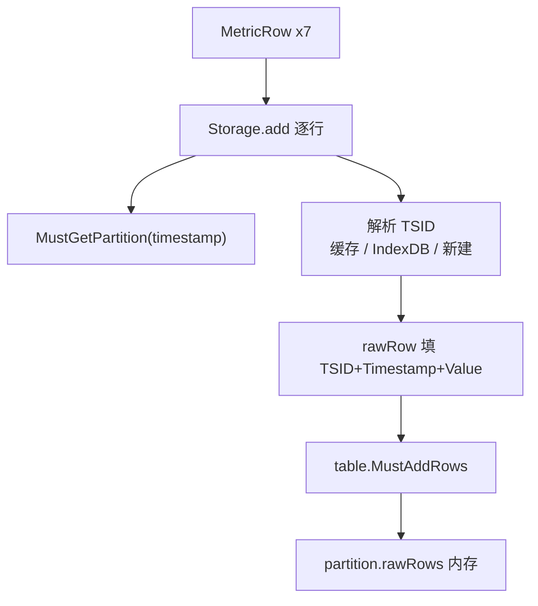
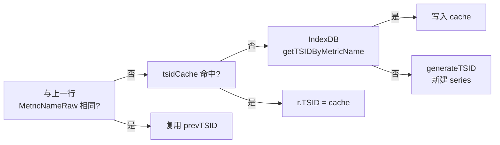
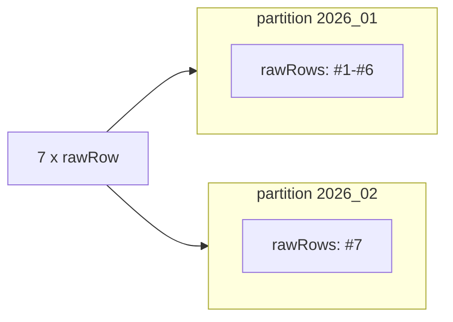
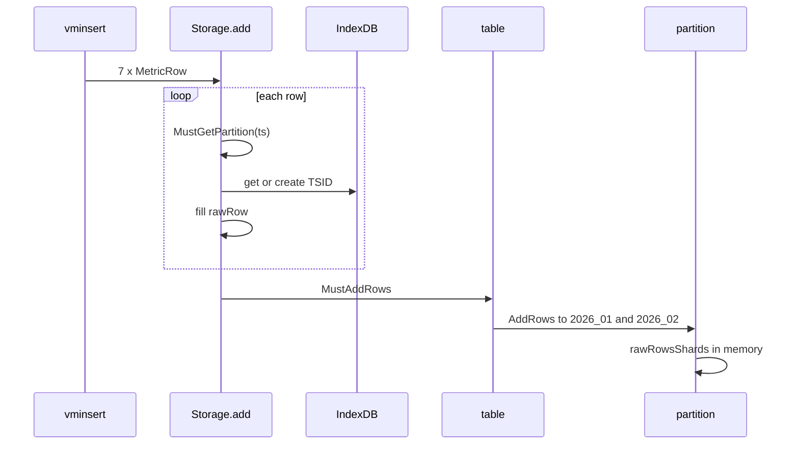

# VictoriaMetrics 写入源码解析（二）：vmstorage 入口 —— AddRows、TSID 与按月 partition

> **系列索引**：[README.md](./README.md)（贯穿示例、目录）  
> **上篇**：[第 1 篇](./01-vminsert-remote-write.md) — vminsert 产出 7 行 `MetricRow`  
> **本篇边界**：从 `vmstorage.AddRows` 进入 `lib/storage`，到 `partition.AddRows` 把行写入 **rawRows 内存队列**；**不展开** rawRows flush、inmemory/disk part（第 3～4 篇）。

> **图表预览**：Mermaid 图见 [系列索引](./README.md#图表预览)。

---

## 1. 本篇要回答的问题

| 问题 | 本篇是否覆盖 |
|------|----------------|
| `MetricRow` 在存储层如何变成 `rawRow`？ | ✅ |
| TSID 是什么、何时分配、与 series 的对应关系？ | ✅ |
| 为何 #7 进 `2026_02` 而 #1～#6 进 `2026_01`？ | ✅ |
| 写入后是否立刻出现磁盘 part 目录？ | ✅（此时**不会**，仅 rawRows） |
| rawRows 如何 flush 成 part？ | ❌ 见第 3 篇 |

---

## 2. 贯穿示例（与系列索引一致）

三条 series、七个点（PromQL 形态便于记忆）：

| Series | 写法 | 本篇关注点 |
|--------|------|------------|
| **S1** | `cpu_usage{host="h1",job="api"}` | 3 个点：#1、#2、#7；#7 **跨月** |
| **S2** | `cpu_usage{host="h2",job="api"}` | 2 个点：#3、#4 |
| **S3** | `http_requests_total{host="h1",path="/x"}` | 2 个点：#5、#6 |

```text
时间线（UTC）
2026-01-15 10:00 ── #1 S1, #3 S2, #5 S3
2026-01-15 10:01 ── #2 S1, #6 S3
2026-01-15 10:02 ── #4 S2
2026-02-03 08:00 ── #7 S1  →  partition 2026_02
```

**本篇结束时**每条样本在内存中的形态：

```text
rawRow { TSID, Timestamp, Value, PrecisionBits }
         ↑
    3 个不同的 MetricID（S1/S2/S3 各一）
    #7 与 #1 共用 S1 的 TSID，但 Timestamp 路由到不同 partition
```

---

## 3. 模块层次与职责边界



| 模块 | 路径 | 本篇负责 | 本篇不负责 |
|------|------|----------|------------|
| **vmstorage 进程 API** | `app/vmstorage/main.go` | 只读检查、调用 `Storage.AddRows` | TSID 算法细节 |
| **Storage** | `lib/storage/storage.go` | `AddRows` / `add`：`MetricRow`→`rawRow`、查/建 TSID | 刷盘 part |
| **table** | `lib/storage/table.go` | 按时间戳选/建 partition、`MustAddRows` 分桶 | block 编码 |
| **partition** | `lib/storage/partition.go` | `AddRows` → `rawRows` | merge、磁盘 5 文件 |
| **IndexDB** | `lib/storage/index_db.go` | series 索引、`generateTSID` | 查询路径；详见 [IndexDB 专题](./05-indexdb-write-path.md) |

**本篇建议对照阅读的源码**：

```text
app/vmstorage/main.go              # AddRows 入口
lib/storage/storage.go             # AddRows, add, MetricRow
lib/storage/raw_row.go             # rawRow
lib/storage/tsid.go                # TSID 结构
lib/storage/time.go                # timestampToPartitionName
lib/storage/table.go               # MustGetPartition, MustAddRows
lib/storage/partition.go           # AddRows, HasTimestamp, mustCreatePartition
lib/storage/index_db.go            # generateTSID, createGlobalIndexes
```

---

## 4. 入口：`vmstorage.AddRows` → `Storage.AddRows`

第 1 篇在 `FlushBufs` 调用 `vmstorage.AddRows`。进程侧包装很薄：

```205:213:app/vmstorage/main.go
func AddRows(mrs []storage.MetricRow) error {
	if Storage.IsReadOnly() {
		return errReadOnly
	}
	resetResponseCacheIfNeeded(mrs)
	WG.Add(1)
	Storage.AddRows(mrs, uint8(*precisionBits))
	WG.Done()
	return nil
}
```

**边界**：`app/vmstorage` 不做 TSID / partition；真正逻辑在 `lib/storage.Storage.AddRows`。

`Storage.AddRows` 将大批量 `MetricRow` **分块**（每块最多 8000 行）后调用 `add`：

```1626:1650:lib/storage/storage.go
func (s *Storage) AddRows(mrs []MetricRow, precisionBits uint8) {
	if len(mrs) == 0 {
		return
	}

	ic := getMetricRowsInsertCtx()
	maxBlockLen := len(ic.rrs)
	for len(mrs) > 0 {
		mrsBlock := mrs
		if len(mrs) > maxBlockLen {
			mrsBlock = mrs[:maxBlockLen]
			mrs = mrs[maxBlockLen:]
		} else {
			mrs = nil
		}
		rowsAdded := s.add(ic.rrs, ic.tmpMrs, mrsBlock, precisionBits)
		s.rowsAddedTotal.Add(uint64(rowsAdded))
		s.rowsReceivedTotal.Add(uint64(len(mrsBlock)))
	}
	putMetricRowsInsertCtx(ic)
}
```

本系列 7 行远小于 `maxMetricRowsPerBlock`（8000），**一次 `add` 即可处理全部**。

---

## 5. 核心：`Storage.add` —— 从 `MetricRow` 到带 TSID 的 `rawRow`

### 5.1 两种行结构

```1553:1560:lib/storage/storage.go
type MetricRow struct {
	MetricNameRaw []byte
	Timestamp int64
	Value     float64
}
```

```11:27:lib/storage/raw_row.go
type rawRow struct {
	TSID TSID
	Timestamp int64
	Value float64
	PrecisionBits uint8
}
```

**边界**：vminsert 只认识 `MetricNameRaw`；**TSID 在 `add` 内写入** `rawRow`。

### 5.2 处理流水线（总览）



对每一行，`add` 先做保留期/NaN 校验，再拷贝时间戳与值，然后按**样本时间戳**切换 partition 并解析 TSID：

```1912:1932:lib/storage/storage.go
		dstMrs[j] = mr
		r := &rows[j]
		j++
		r.Timestamp = mr.Timestamp
		r.Value = mr.Value
		r.PrecisionBits = precisionBits
		date := uint64(r.Timestamp) / msecPerDay
		hour := uint64(r.Timestamp) / msecPerHour

		if ptw == nil || !ptw.pt.HasTimestamp(r.Timestamp) {
			if ptw != nil {
				if is != nil {
					idb.putIndexSearch(is)
				}
				s.tb.PutPartition(ptw)
			}
			ptw = s.tb.MustGetPartition(r.Timestamp)
			idb = ptw.pt.idb
			is = idb.getIndexSearch(noDeadline)
			deletedMetricIDs = idb.getDeletedMetricIDs()
		}
```

处理 **#7** 时，`HasTimestamp` 对当前 `2026_01` partition 为 false → 释放旧 partition → `MustGetPartition` 拿到 **`2026_02`**。这是跨月在代码里的直接体现。

### 5.3 TSID 解析的三条路径（同一 `MetricNameRaw` 可命中快路径）



**路径 1 — 相邻行同名（bulk import 常见）**

```1934:1956:lib/storage/storage.go
		if string(mr.MetricNameRaw) == string(prevMetricNameRaw) {
			// Fast path - the current mr contains the same metric name as the previous mr
			if !is.hasMetricID(prevTSID.MetricID) {
				// ... 当前月 IndexDB 尚无该 MetricID → createGlobalIndexes
				idb.createGlobalIndexes(&prevTSID, mn)
			}
			r.TSID = prevTSID
			continue
		}
```

对本示例：若 #1、#2 连续且 `MetricNameRaw` 相同，**#2 不走 IndexDB 全表扫描**。

**路径 2 — tsidCache**

```1967:1971:lib/storage/storage.go
		if s.getTSIDByMetricNameFromCache(&lTSID, mr.MetricNameRaw) && !deletedMetricIDs.Has(lTSID.TSID.MetricID) {
			r.TSID = lTSID.TSID
			prevTSID = r.TSID
			prevMetricNameRaw = mr.MetricNameRaw
```

**路径 3 — IndexDB 慢路径 / 最慢新建**

```2023:2045:lib/storage/storage.go
		if is.getTSIDByMetricName(&lTSID.TSID, metricNameBuf, date) {
			s.putTSIDByMetricNameToCache(&lTSID, mr.MetricNameRaw)
			r.TSID = lTSID.TSID
			// ...
			continue
		}

		generateTSID(&lTSID.TSID, mn)
		createAllIndexesForMetricName(idb, mn, &lTSID.TSID, date)
		s.putTSIDByMetricNameToCache(&lTSID, mr.MetricNameRaw)
		newSeriesCount++
		r.TSID = lTSID.TSID
```

`add` 结束后调用 `table.MustAddRows`：

```2090:2092:lib/storage/storage.go
	s.tb.MustAddRows(rows)

	return len(rows)
```

---

## 6. TSID 与 IndexDB：三条 series → 三个 `MetricID`

### 6.1 `TSID` 各字段含义

```10:52:lib/storage/tsid.go
// TSID is unique id for a time series.
type TSID struct {
	MetricGroupID uint64   // 指标名分组，如 cpu_usage
	JobID uint32             // 常来自排序后第 1 个 tag（见 generateTSID）
	InstanceID uint32        // 常来自第 2 个 tag
	MetricID uint64          // 单条 series 的全局唯一 id
}
```

**边界**：对外查询、块排序主要认 **`MetricID`**；`MetricGroupID` / `JobID` / `InstanceID` 用于相近 series 在磁盘上邻近存放（见 `generateTSID` 注释）。

### 6.2 新 series 如何生成 TSID

```412:426:lib/storage/index_db.go
func generateTSID(dst *TSID, mn *MetricName) {
	dst.MetricGroupID = xxhash.Sum64(mn.MetricGroup)
	if len(mn.Tags) > 0 {
		dst.JobID = uint32(xxhash.Sum64(mn.Tags[0].Value))
	}
	if len(mn.Tags) > 1 {
		dst.InstanceID = uint32(xxhash.Sum64(mn.Tags[1].Value))
	}
	dst.MetricID = generateUniqueMetricID()
}
```

调用前必须 `mn.UnmarshalRaw` + `mn.sortTags()`（`add` 慢路径已保证）。

### 6.3 示例映射表

| # | Series（逻辑） | `MetricNameRaw` 是否相同 | `TSID.MetricID` | partition |
|---|----------------|--------------------------|-----------------|-----------|
| 1 | S1 | 基准 | **M1** | `2026_01` |
| 2 | S1 | 同 #1 | **M1** | `2026_01` |
| 3 | S2 | 新 series | **M2** | `2026_01` |
| 4 | S2 | 同 #3 | **M2** | `2026_01` |
| 5 | S3 | 新 series | **M3** | `2026_01` |
| 6 | S3 | 同 #5 | **M3** | `2026_01` |
| 7 | S1 | 同 #1 | **M1**（同一 series） | **`2026_02`** |

> **结论**：partition 按**样本时间戳**划分；TSID 按 **metric 名 + labels** 划分。#7 与 #1 **共享 M1**，但落在不同 partition 目录。

### 6.4 跨月时 IndexDB 的「再注册」

每个 partition 自带 **IndexDB**（目录名同为 `2026_01` / `2026_02`）。S1 在 1 月已创建 TSID 后，2 月 partition 的 IndexDB 里可能还没有该 `MetricID`，于是走：

```1974:1990:lib/storage/storage.go
			if !is.hasMetricID(lTSID.TSID.MetricID) {
				// The found TSID is from the another partition indexdb. Create it in the current partition indexdb.
				idb.createGlobalIndexes(&lTSID.TSID, mn)
```

**边界**：这是 **索引在当月 DB 的补写**，不是新建另一条 series。

---

## 7. 按月 partition：名字、范围、路由

### 7.1 partition 名 = UTC 年月

```78:82:lib/storage/time.go
func timestampToPartitionName(timestamp int64) string {
	t := timestampToTime(timestamp)
	return t.Format("2006_01")
}
```

| 样本 | 时间戳（ms） | `timestampToPartitionName` |
|------|--------------|----------------------------|
| #1 | `1768471200000` | `2026_01` |
| #7 | `1770105600000` | `2026_02` |

**不可按天配置**：格式写死为 `2006_01`，范围由 `fromPartitionTime` 定为当月 UTC `[月初, 下月初)`：

```100:107:lib/storage/time.go
func (tr *TimeRange) fromPartitionTime(t time.Time) {
	y, m, _ := t.UTC().Date()
	minTime := time.Date(y, m, 1, 0, 0, 0, 0, time.UTC)
	maxTime := time.Date(y, m+1, 1, 0, 0, 0, 0, time.UTC)
	tr.MinTimestamp = minTime.Unix() * 1e3
	tr.MaxTimestamp = maxTime.Unix()*1e3 - 1
}
```

### 7.2 `MustGetPartition`：不存在则创建目录

```548:566:lib/storage/table.go
func (tb *table) MustGetPartition(timestamp int64) *partitionWrapper {
	tb.ptwsLock.Lock()
	defer tb.ptwsLock.Unlock()

	ptw := tb.getPartitionLocked(timestamp)
	if ptw != nil {
		return ptw
	}

	pt := mustCreatePartition(timestamp, tb.smallPartitionsPath, tb.bigPartitionsPath, tb.indexDBPath, tb.s)
	ptw = tb.addPartitionWrapperLocked(pt)
	ptw.incRef()
	return ptw
}
```

新建 partition 时目录名同样来自 `timestampToPartitionName`：

```203:211:lib/storage/partition.go
func mustCreatePartition(timestamp int64, smallPartitionsPath, bigPartitionsPath, indexDBPath string, s *Storage) *partition {
	var tr TimeRange
	tr.fromPartitionTimestamp(timestamp)
	name := timestampToPartitionName(timestamp)
	// smallPartsPath / bigPartsPath / indexDBPartsPath 下各建 name 子目录
```

校验样本是否落在 partition 内：

```912:915:lib/storage/partition.go
func (pt *partition) HasTimestamp(timestamp int64) bool {
	return pt.tr.contains(timestamp)
}
```

### 7.3 `table.MustAddRows`：一批行可能拆到两个 partition

7 行里含 `2026_01` 与 `2026_02` 时，往往走 **慢路径**：按 partition 分桶后分别 `AddRows`：

```342:362:lib/storage/table.go
	ptBuckets := make(map[*partitionWrapper][]rawRow)
	// ...
	for ptw, ptRows := range ptBuckets {
		ptw.pt.AddRows(ptRows)
	}
```

对本示例：6 行进 `2026_01` 的 `rawRows`，1 行进 `2026_02` 的 `rawRows`。



---

## 8. `partition.AddRows`：本篇终点（内存 rawRows）

```457:480:lib/storage/partition.go
func (pt *partition) AddRows(rows []rawRow) {
	// debug 下校验 HasTimestamp、PrecisionBits
	pt.rawRows.addRows(pt, rows)
}
```

```500:509:lib/storage/partition.go
func (rrss *rawRowsShards) addRows(pt *partition, rows []rawRow) {
	shards := rrss.shards
	for len(rows) > 0 {
		n := rrss.shardIdx.Add(1)
		idx := n % shardsLen
		tailRows, rowsToFlush := shards[idx].addRows(rows)
		rrss.addRowsToFlush(pt, rowsToFlush)
		rows = tailRows
	}
}
```

**边界（易误解）**：

| 现象 | 是否在本篇发生 | 依据 |
|------|----------------|------|
| 内存中有待 flush 的 rawRows | ✅ | `rawRowsShards.addRows` |
| 磁盘上出现含 5 个文件的 part 目录 | ❌ | 由 `inmemoryPartsFlusher` 落盘（[第 4 篇](./04-part-block-disk.md)） |
| `mustCreatePartition` 创建空目录树 | ✅（首次跨月） | `mustCreatePartition` 建 `2026_02` 路径，但 **part 文件**仍要等 flush |

---

## 9. 端到端对照：7 行输入在本篇的输出



| 阶段 | 数据结构 | TSID | partition | 磁盘 part |
|------|----------|------|-----------|-----------|
| 第 1 篇出口 | `MetricRow` | ❌ | ❌ | ❌ |
| **本篇出口** | `rawRow` in shard | ✅ | ✅ 已路由 | ❌ |

---

## 10. 与 Prometheus 概念对照

| Prometheus | 本篇代码 |
|------------|----------|
| 一条 series | 唯一 `MetricNameRaw` → 一个 `TSID.MetricID` |
| 一个 sample | 一行 `rawRow`（时间戳 + 值） |
| 无「按月 shard」概念 | VM 用 `timestampToPartitionName` 强制 UTC 月分区 |
| 同 series 跨月 | 同一 TSID，不同 partition + 可能 `createGlobalIndexes` |

---

## 11. 本篇小结

1. **入口**：`vmstorage.AddRows` → `Storage.AddRows` → 分块 `add`。  
2. **核心**：每行 `MetricRow` 变为 `rawRow`，在 **`MustGetPartition(样本时间戳)`** 对应的 IndexDB 上解析/创建 TSID。  
3. **示例**：S1/S2/S3 → **M1/M2/M3**；#7 与 #1 同 **M1**，partition 为 **`2026_02`**。  
4. **本篇终点**：`partition.AddRows` → **rawRows 内存**；flush 与 inmemory part 见 [第 3 篇](./03-rawrows-flush-inmemory-part.md)。

---

## 12. 下篇预告

**第 3 篇**：[03-rawrows-flush-inmemory-part.md](./03-rawrows-flush-inmemory-part.md) — rawRows 缓冲与 flush → inmemory part

---

## 附录：系列目录

| 篇 | 文件 | 边界 |
|----|------|------|
| 1 | [01-vminsert-remote-write.md](./01-vminsert-remote-write.md) | HTTP → `MetricRow` |
| **2（本篇）** | 本文 | `MetricRow` → `rawRow` + partition 路由 |
| [3](./03-rawrows-flush-inmemory-part.md) | rawRows → inmemory part |
| [4](./04-part-block-disk.md) | part / 磁盘 / merge |
| [专题](./05-indexdb-write-path.md) | IndexDB 写入与存储 |
| 6 | *待写* | flags / FAQ |

完整索引：[README.md](./README.md)
