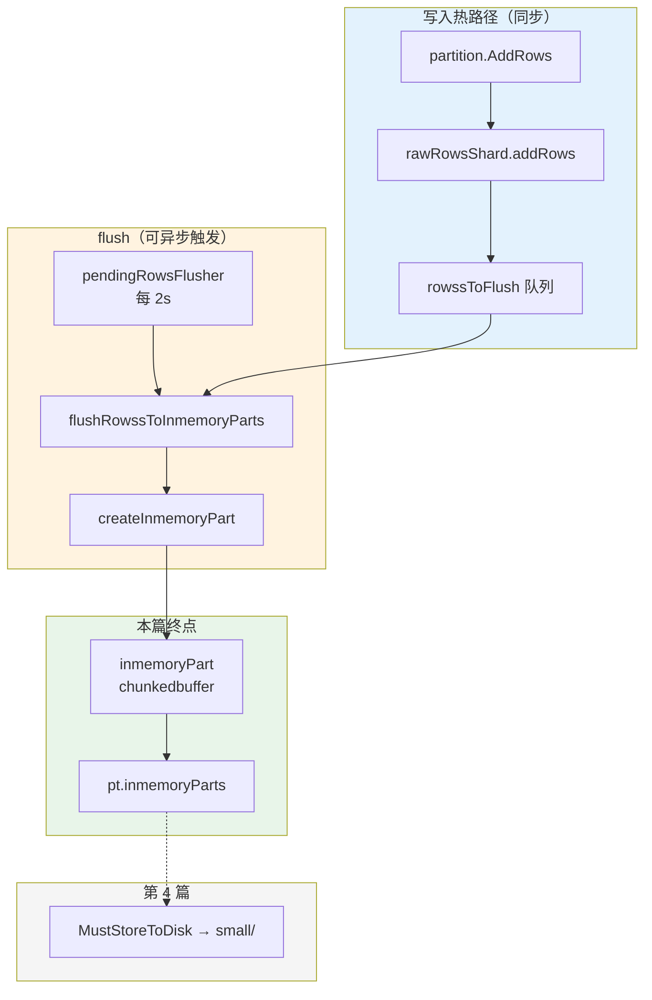
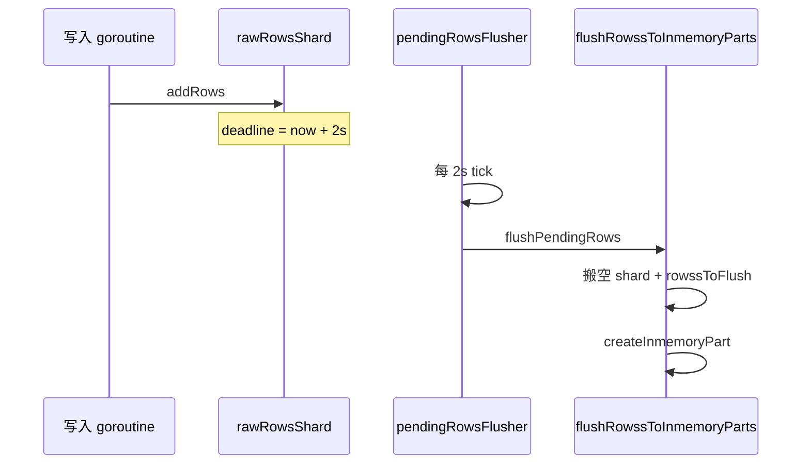
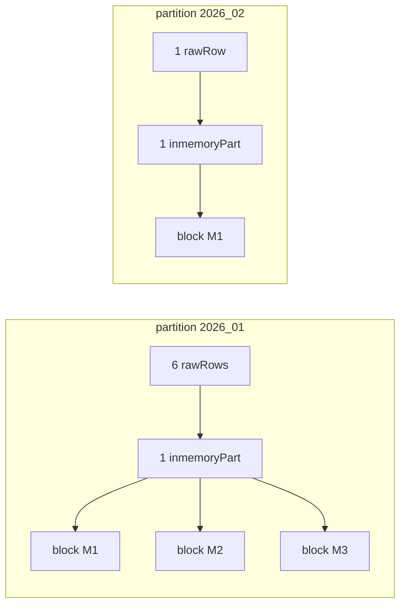

# VictoriaMetrics 写入源码解析（三）：rawRows 缓冲与 flush → inmemory part

> **系列索引**：[README.md](./README.md)  
> **上篇**：[第 2 篇](./02-vmstorage-addrows-tsid.md) — `partition.AddRows` 将 7 行写入 **rawRows 内存**  
> **本篇边界**：`rawRowsShards` 如何攒批、何时 flush、如何编码为 **inmemory part**（仍在内存）；**不展开** 落盘目录、small/big merge（第 4 篇）。

> **图表预览**：见 [系列索引](./README.md#图表预览)。

---

## 1. 本篇要回答的问题

| 问题 | 本篇是否覆盖 |
|------|----------------|
| 第 2 篇写入的 rawRows 存在哪、结构怎样？ | ✅ |
| 什么条件下 flush 成 inmemory part？ | ✅ |
| 本系列 7 个点 flush 后大约几个 part、几个 block？ | ✅（结合代码推演） |
| inmemory part 里已有 timestamps/values/index 等数据吗？ | ✅（内存 buffer，形态与磁盘 part 一致） |
| 何时写入磁盘 `small/` 目录？ | ❌ 见第 4 篇（`inmemoryPartsFlusher`） |

---

## 2. 贯穿示例：7 个点在本篇的状态

第 2 篇结束后：

| partition | rawRows 中的行 | 行数 |
|-----------|----------------|------|
| `2026_01` | #1～#6 | 6 |
| `2026_02` | #7 | 1 |

```text
2026_01 partition
  rawRowsShards ──► (最多等待 2s 或 shard 满) ──► inmemory part(s)
  #1,#2  → TSID M1
  #3,#4  → TSID M2
  #5,#6  → TSID M3

2026_02 partition
  rawRowsShards ──► inmemory part
  #7     → TSID M1（与 #1 相同 series）
```

**本篇终点**：每个 partition 的 `pt.inmemoryParts` 里挂上 `partWrapper`（内存 part），**通常还没有** `small/2026_01/<part-id>/` 这类磁盘目录。

---

## 3. 模块层次与职责边界



| 组件 | 文件 | 本篇职责 | 本篇不负责 |
|------|------|----------|------------|
| `rawRowsShards` / `rawRowsShard` | `partition.go` | 分片缓冲、deadline、溢出 flush | TSID 分配 |
| `rawRowsMarshaler` | `raw_row.go` | 排序、按 TSID 组 **block** | 查询执行 |
| `inmemoryPart` | `inmemory_part.go` | 内存中的 part 四件套 buffer | 长期 retention |
| `pendingRowsFlusher` | `partition.go` | 定时把 rawRows → inmemory | 磁盘 fsync |
| `inmemoryPartsFlusher` | `partition.go` | — | 内存 part → 磁盘（第 4 篇） |

**建议阅读源码**：

```text
lib/storage/partition.go    # rawRowsShards, flush*, createInmemoryPart
lib/storage/raw_row.go      # marshalToInmemoryPart, block 分组
lib/storage/inmemory_part.go
lib/storage/filenames.go    # 文件名常量（与磁盘 part 相同）
app/victoria-metrics/main.go  # -inmemoryDataFlushInterval
```

---

## 4. rawRows 缓冲：分片、容量、可见性

### 4.1 为何用多分片

```43:46:lib/storage/partition.go
// The number of shards for rawRow entries per partition.
var rawRowsShardsPerPartition = cgroup.AvailableCPUs()
```

每个 partition 的 `rawRows` 是 **`CPU 核数个 shard`**，降低多核写入时的锁竞争。`partition.AddRows` 轮询 shard：

```500:509:lib/storage/partition.go
func (rrss *rawRowsShards) addRows(pt *partition, rows []rawRow) {
	shards := rrss.shards
	shardsLen := uint32(len(shards))
	for len(rows) > 0 {
		n := rrss.shardIdx.Add(1)
		idx := n % shardsLen
		tailRows, rowsToFlush := shards[idx].addRows(rows)
		rrss.addRowsToFlush(pt, rowsToFlush)
		rows = tailRows
	}
}
```

对本系列 **6+1 行**：数据量远小于 shard 上限，通常落在**少数几个 shard**，且**不会**因 shard 满而提前 `rowsToFlush`。

### 4.2 单 shard 容量上限

```69:72:lib/storage/partition.go
// Limit the maximum shard size to 8Mb
const maxRawRowsPerShard = (8 << 20) / int(unsafe.Sizeof(rawRow{}))
```

`rawRow` 含 `TSID` + 时间戳 + 值，单行几十字节量级；**8MB / 单行** 可容数十万行，7 行不可能触顶。

### 4.3 搜索可见性

```115:119:lib/storage/partition.go
	// rawRows contains recently added rows that haven't been converted into parts yet.
	//
	// rawRows are converted into inmemoryParts on every pendingRowsFlushInterval or when rawRows becomes full.
	//
	// rawRows aren't visible for search due to performance reasons.
```

**边界**：在 flush 成 inmemory part 之前，数据只在 rawRows 里，**查询路径看不到**（设计取舍，非 bug）。

---

## 5. 写入 shard：`addRows` 与溢出

```573:597:lib/storage/partition.go
func (rrs *rawRowsShard) addRows(rows []rawRow) ([]rawRow, []rawRow) {
	var rowsToFlush []rawRow

	rrs.mu.Lock()
	if cap(rrs.rows) == 0 {
		rrs.rows = newRawRows()
	}
	if len(rrs.rows) == 0 {
		rrs.updateFlushDeadline()
	}
	n := copy(rrs.rows[len(rrs.rows):cap(rrs.rows)], rows)
	rrs.rows = rrs.rows[:len(rrs.rows)+n]
	rows = rows[n:]
	if len(rows) > 0 {
		rowsToFlush = rrs.rows
		rrs.rows = newRawRows()
		rrs.updateFlushDeadline()
		// ... 把剩余 rows 写入新 slice
	}
	rrs.mu.Unlock()

	return rows, rowsToFlush
}
```

- 第一次向空 shard 追加时，设置 **`flushDeadlineMs = now + 2s`**（`pendingRowsFlushInterval`）。
- 仅当 `cap` 用尽仍有剩余行时，才把当前 `rrs.rows` 作为 **`rowsToFlush`** 交给 `addRowsToFlush`。

对本示例：6 行进 `2026_01` 时**不会**走溢出分支，行一直留在 shard 直到**定时 flush**。

---

## 6. 何时 flush：三条触发路径

### 6.1 常量与后台协程

```41:52:lib/storage/partition.go
const defaultPartsToMerge = 15

const pendingRowsFlushInterval = 2 * time.Second

var dataFlushInterval = 5 * time.Second
```

| 常量 /  flag | 值 | 作用 |
|--------------|-----|------|
| `pendingRowsFlushInterval` | 2s | rawRows → inmemory part（**本篇主时钟**） |
| `dataFlushInterval` | 默认 5s，可由 `-inmemoryDataFlushInterval` 设置 | inmemory part → **磁盘**（第 4 篇） |
| `defaultPartsToMerge` | 15 | `rowssToFlush` 批次数达到 15 时**提前** flush |
| `maxRawRowsPerShard` | ~8MB 行 | 单 shard 满时**立即**溢出 flush |

启动 partition 时注册 flusher：

```236:243:lib/storage/partition.go
	pt.startPendingRowsFlusher()
	pt.startInmemoryPartsFlusher()
```

```1125:1137:lib/storage/partition.go
func (pt *partition) pendingRowsFlusher() {
	d := pendingRowsFlushInterval
	ticker := time.NewTicker(d)
	for {
		select {
		case <-pt.stopCh:
			return
		case <-ticker.C:
			pt.flushPendingRows(false)
		}
	}
}
```

进程 flag（落盘间隔，本篇仅预告）：

```38:39:app/victoria-metrics/main.go
	inmemoryDataFlushInterval = flag.Duration("inmemoryDataFlushInterval", 5*time.Second, "The interval for guaranteed saving of in-memory data to disk. "+
```

```91:91:app/victoria-metrics/main.go
	storage.SetDataFlushInterval(*inmemoryDataFlushInterval)
```

`SetDataFlushInterval` 不允许小于 `pendingRowsFlushInterval`（2s），否则无意义：

```59:64:lib/storage/partition.go
	if d < pendingRowsFlushInterval {
		d = pendingRowsFlushInterval
	}
```

### 6.2 路径 A：定时 flush（本示例的主路径）



```1167:1184:lib/storage/partition.go
func (rrss *rawRowsShards) flush(pt *partition, isFinal bool) {
	var dst [][]rawRow

	currentTimeMs := time.Now().UnixMilli()
	flushDeadlineMs := rrss.flushDeadlineMs.Load()
	if isFinal || currentTimeMs >= flushDeadlineMs {
		rrss.rowssToFlushLock.Lock()
		dst = rrss.rowssToFlush
		rrss.rowssToFlush = nil
		rrss.rowssToFlushLock.Unlock()
	}

	for i := range rrss.shards {
		dst = rrss.shards[i].appendRawRowsToFlush(dst, currentTimeMs, isFinal)
	}

	pt.flushRowssToInmemoryParts(dst)
}
```

每个 shard 在 `currentTimeMs >= flushDeadlineMs` 时把 `rows` 移入 `dst`：

```1186:1199:lib/storage/partition.go
func (rrs *rawRowsShard) appendRawRowsToFlush(dst [][]rawRow, currentTimeMs int64, isFinal bool) [][]rawRow {
	flushDeadlineMs := rrs.flushDeadlineMs.Load()
	if !isFinal && currentTimeMs < flushDeadlineMs {
		return dst
	}
	rrs.mu.Lock()
	dst = appendRawRowss(dst, rrs.rows)
	rrs.rows = rrs.rows[:0]
	rrs.mu.Unlock()
	return dst
}
```

**对本示例**：写入后 **≤约 2 秒**，`2026_01` 的 6 行与 `2026_02` 的 1 行分别在自己的 partition 里被 flush（两个 partition 各有一个 `pendingRowsFlusher`）。

### 6.3 路径 B：`rowssToFlush` 满 15 批（高吞吐）

```512:530:lib/storage/partition.go
	rrss.rowssToFlush = append(rrss.rowssToFlush, rowsToFlush)
	if len(rrss.rowssToFlush) >= defaultPartsToMerge {
		rowssToMerge = rrss.rowssToFlush
		rrss.rowssToFlush = nil
	}
	pt.flushRowssToInmemoryParts(rowssToMerge)
```

仅当 shard **溢出**产生多批 `rowsToFlush` 且累计 ≥15 批时才触发。7 行写入**不会**走这条路径。

### 6.4 路径 C：shard 满 8MB（溢出）

见 §5：大批量导入时，单 shard `copy` 填满 `cap(maxRawRowsPerShard)` 后立即 `rowsToFlush`。本示例**不触发**。

### 6.5 本示例 flush 结果（推演）

| partition | flush 批次（典型） | `createInmemoryPart` 输入行数 | 合并后 inmemory part 数 |
|-----------|-------------------|------------------------------|-------------------------|
| `2026_01` | 1 批（6 行） | 6 | **1**（见下节 block 数 = 3） |
| `2026_02` | 1 批（1 行） | 1 | **1** |

> 一次 `AddRows` **不会**保证只产生一个 part；高并发、多 shard 溢出、或 merge 后仍超 `maxInmemoryPartSize` 时可能多个。本示例是**最简单**情况。

---

## 7. `flushRowssToInmemoryParts`：编码与挂链

### 7.1 并行创建 inmemory part

```603:647:lib/storage/partition.go
func (pt *partition) flushRowssToInmemoryParts(rowss [][]rawRow) {
	// ...
	for _, rows := range rowss {
		wg.Go(func() {
			pw := pt.createInmemoryPart(rows)
			// ...
		})
	}
	// 若多个 pw，先 mustMergeInmemoryParts，再按 maxPartSize 决定是否 addToInmemoryParts
	maxPartSize := getMaxInmemoryPartSize()
	// ...
	if len(pws) == 1 {
		pt.addToInmemoryParts(pws[0])
	}
}
```

```877:898:lib/storage/partition.go
func (pt *partition) createInmemoryPart(rows []rawRow) *partWrapper {
	mp := getInmemoryPart()
	mp.InitFromRows(rows)
	flushToDiskDeadline := time.Now().Add(dataFlushInterval)
	return newPartWrapperFromInmemoryPart(mp, flushToDiskDeadline)
}
```

`flushToDiskDeadline` 为 **now + dataFlushInterval**（默认 5s），供第 4 篇 `inmemoryPartsFlusher` 使用，**不是**本篇 flush rawRows 的时钟。

```649:654:lib/storage/partition.go
func (pt *partition) addToInmemoryParts(pw *partWrapper) {
	pt.partsLock.Lock()
	pt.inmemoryParts = append(pt.inmemoryParts, pw)
	pt.startInmemoryPartsMergerLocked()
	pt.partsLock.Unlock()
}
```

### 7.2 `inmemoryPart` 内存布局

```14:24:lib/storage/inmemory_part.go
type inmemoryPart struct {
	ph partHeader

	timestampsData chunkedbuffer.Buffer
	valuesData     chunkedbuffer.Buffer
	indexData      chunkedbuffer.Buffer
	metaindexData  chunkedbuffer.Buffer

	creationTime uint64
}
```

与磁盘 part 相同的四个数据文件（见 `filenames.go`），只是先用 **内存 buffer** 持有：

```3:9:lib/storage/filenames.go
const (
	metaindexFilename  = "metaindex.bin"
	indexFilename      = "index.bin"
	valuesFilename     = "values.bin"
	timestampsFilename = "timestamps.bin"
	// ...
	metadataFilename   = "metadata.json"
)
```

落盘时 `MustStoreToDisk` 写出上述文件 + `metadata.json`（第 4 篇）。

```59:69:lib/storage/inmemory_part.go
func (mp *inmemoryPart) InitFromRows(rows []rawRow) {
	mp.Reset()
	rrm := getRawRowsMarshaler()
	rrm.marshalToInmemoryPart(mp, rows)
	putRawRowsMarshaler(rrm)
	mp.creationTime = fasttime.UnixTimestamp()
}
```

---

## 8. rawRows → block：排序与按 TSID 分组

### 8.1 排序键

```97:101:lib/storage/raw_row.go
	rrs := rawRowsSort(rows)
	if !sort.IsSorted(&rrs) {
		sort.Sort(&rrs)
	}
```

`rawRowsSort.Less` 先比 `TSID`（`MetricGroupID` → `JobID` → `InstanceID` → `MetricID`），再比 `Timestamp`（见 `raw_row.go` 中 `Less` 实现）。

### 8.2 同一 TSID 合并为一个 block

```111:127:lib/storage/raw_row.go
	for i := range rows {
		r = &rows[i]
		if r.TSID.MetricID == tsid.MetricID && len(rrm.auxTimestamps) < maxRowsPerBlock {
			rrm.auxTimestamps = append(rrm.auxTimestamps, r.Timestamp)
			rrm.auxFloatValues = append(rrm.auxFloatValues, r.Value)
			continue
		}
		// 否则写出上一个 block，开始新 block
```

**block** = 同一 `MetricID`（一条 series）的一段连续样本，压缩写入 `timestamps.bin` / `values.bin`，索引写入 `index.bin` / `metaindex.bin`。

### 8.3 本示例 block 划分（`2026_01` 的 6 行）

| block | TSID | 样本 | 说明 |
|-------|------|------|------|
| B1 | M1（S1） | #1, #2 | 同 series、两时间点 |
| B2 | M2（S2） | #3, #4 | |
| B3 | M3（S3） | #5, #6 | |

→ **1 个 inmemory part**，内含 **3 个 block**（`rowsMerged == 6` 由 `marshalToInmemoryPart` 末尾校验）。

`2026_02` 仅 #7：**1 part，1 block**。



---

## 9. 本篇 vs 第 2 篇 vs 第 4 篇：边界对照

| 时刻 | 数据在哪 | 能否被查询 | 是否在磁盘 |
|------|----------|------------|------------|
| `partition.AddRows` 刚返回 | `rawRowsShard.rows` | ❌（见 §4.3） | ❌ |
| `pendingRowsFlusher` 之后 | `pt.inmemoryParts` | ✅（进入 part 体系，细节在查询篇） | ❌（仍在内存 buffer） |
| `inmemoryPartsFlusher` 之后 | `small/YYYY_MM/<part-id>/` | ✅ | ✅（第 4 篇） |


---

## 10. 与 Prometheus / 运维概念的对应

| 现象 | 代码含义 |
|------|----------|
| 写入后 2s 内查不到刚写的点 | 可能仍在 rawRows，尚未 flush |
| `-inmemoryDataFlushInterval` | 控制 **内存 part → 磁盘**，不直接改 rawRows 的 2s |
| 高基数突发写入 | 更易触发 shard 溢出、`defaultPartsToMerge` 提前 flush，inmemory part 个数可能 >1 |
| 一条 series 多个点 | 通常落在同一 **block**（未超 `maxRowsPerBlock`） |

---

## 11. 本篇小结

1. **缓冲**：每 partition 有 `rawRowsShards`（按 CPU 分片），单行上限约 8MB/shard。  
2. **触发**：本示例靠 **`pendingRowsFlushInterval`（2s）**；另有 shard 满、15 批 `rowssToFlush` 两条高吞吐路径。  
3. **编码**：`marshalToInmemoryPart` 排序后按 **TSID.MetricID** 组 block；`2026_01` 的 6 行 → **1 个 inmemory part、3 block**。  
4. **终点**：`pt.inmemoryParts`；磁盘 5 文件与 merge 见 [第 4 篇](./04-part-block-disk.md)。

---

## 12. 下篇预告

**第 4 篇**：[04-part-block-disk.md](./04-part-block-disk.md) — part / block 与磁盘落盘

---

## 附录：系列目录

| 篇 | 文件 | 边界 |
|----|------|------|
| 1 | [01-vminsert-remote-write.md](./01-vminsert-remote-write.md) | HTTP → `MetricRow` |
| 2 | [02-vmstorage-addrows-tsid.md](./02-vmstorage-addrows-tsid.md) | → `rawRow` + partition |
| **3（本篇）** | 本文 | rawRows → inmemory part |
| [4](./04-part-block-disk.md) | 磁盘 part / block |
| 5 | *待写* | flags / FAQ |

完整索引：[README.md](./README.md)
