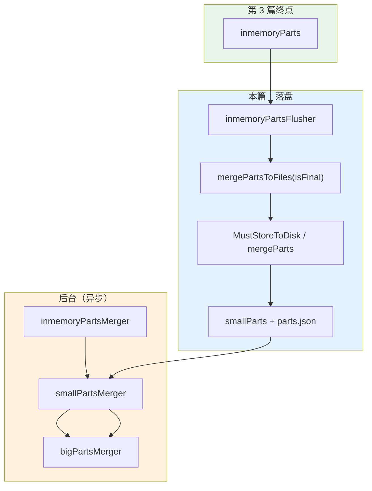
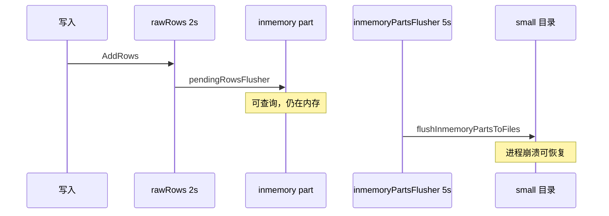
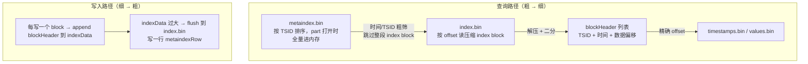
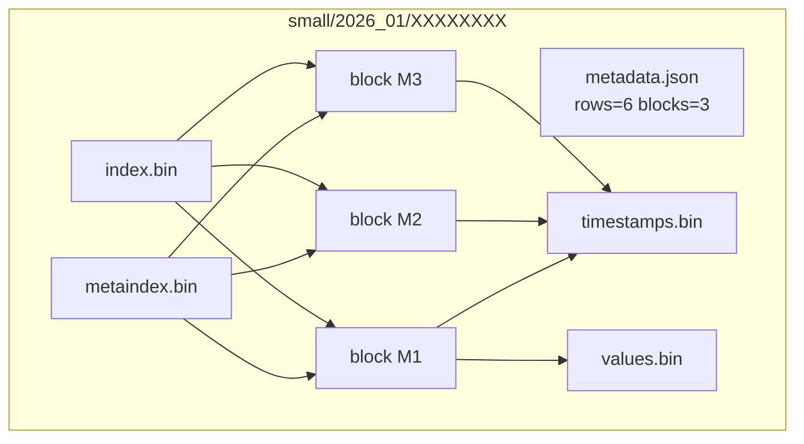

# VictoriaMetrics 写入源码解析（四）：part、block 与磁盘落盘

> **系列索引**：[README.md](./README.md)  
> **上篇**：[第 3 篇](./03-rawrows-flush-inmemory-part.md) — rawRows flush 后数据在 **`inmemoryPart` 内存**  
> **本篇边界**：inmemory part **落盘**为 `small/`（或 `big/`）目录、**5 个数据文件 + metadata**、`parts.json` 注册；说明 **block** 在 part 内的角色；**背景 merge** 如何把小 part 卷成大 part（不展开查询执行）。

> **图表预览**：见 [系列索引](./README.md#图表预览)。

---

## 1. 本篇要回答的问题

| 问题 | 本篇是否覆盖 |
|------|----------------|
| 磁盘上 part 目录长什么样、有哪些文件？ | ✅ |
| **block** 与 **part** 的区别？ | ✅ |
| 第 3 篇的 inmemory part 如何变成 `small/2026_01/<id>/`？ | ✅ |
| `parts.json` 是干什么的？ | ✅ |
| `small` 与 `big` 目录何时用、谁负责 merge？ | ✅ |
| 本系列 7 个点落盘后大约几个目录、几个 block？ | ✅（推演） |
| 写入 flags、并发限制汇总 | ❌ 见第 5 篇 |

---

## 2. 贯穿示例：第 3 篇之后到本篇终点

第 3 篇结束时（约写入后 2s）：

| partition | 内存 | 典型内容 |
|-----------|------|----------|
| `2026_01` | `pt.inmemoryParts` ×1 | 6 行 → **3 block**（M1/M2/M3） |
| `2026_02` | `pt.inmemoryParts` ×1 | 1 行 → **1 block**（M1） |

本篇（默认 `-inmemoryDataFlushInterval=5s`）之后：

```text
<dataDir>/data/
  small/
    2026_01/
      parts.json              ← 登记 small part 目录名列表
      0000000000000001/        ← 示例 ID（实际为 mergeIdx 十六进制）
        timestamps.bin
        values.bin
        index.bin
        metaindex.bin
        metadata.json
    2026_02/
      parts.json
      0000000000000001/
        （同上 5+1 文件）
  big/
    2026_01/                  ← 初期通常为空或很少
    2026_02/
  indexdb/
    2026_01/                  ← series 索引（第 2 篇），本篇不展开
    2026_02/
```

**边界**：7 个点体量极小，通常各 partition **各 1 个 small part**；后台 **small→big** merge 可能要等更多 part 或更大体积后才发生（见 §8）。

---

## 3. 模块层次与职责边界



| 组件 | 文件 | 本篇重点 | 不负责 |
|------|------|----------|--------|
| `inmemoryPartsFlusher` | `partition.go` | 到期 inmemory → 磁盘 small | rawRows 2s flush |
| `mergeParts` / `MustStoreToDisk` | `partition.go`, `inmemory_part.go` | 写 5 文件 + metadata | TSID |
| `part` / `partHeader` | `part.go`, `part_header.go` | 可读 part 抽象 | HTTP |
| `Block` / `blockHeader` | `block.go`, `block_header.go` | 单 TSID 样本列 | PromQL |
| `mustWritePartNames` | `partition.go` | `parts.json` | IndexDB 内容 |

**建议阅读源码**：

```text
lib/storage/partition.go       # flushInmemoryPartsToFiles, mergeParts, swapSrcWithDstParts
lib/storage/inmemory_part.go   # MustStoreToDisk
lib/storage/part.go            # mustOpenFilePart
lib/storage/part_header.go     # metadata.json
lib/storage/filenames.go
lib/storage/block.go
lib/storage/block_header.go
app/victoria-metrics/main.go   # -inmemoryDataFlushInterval
```

---

## 4. 目录布局：partition、small/big、part 实例

创建 partition 时同时建好三类路径（与第 2 篇 `mustCreatePartition` 一致）：

```208:215:lib/storage/partition.go
	smallPartsPath := filepath.Join(filepath.Clean(smallPartitionsPath), name)
	bigPartsPath := filepath.Join(filepath.Clean(bigPartitionsPath), name)
	indexDBPartsPath := filepath.Join(filepath.Clean(indexDBPath), name)
	// ...
	fs.MustMkdirFailIfExist(smallPartsPath)
	fs.MustMkdirFailIfExist(bigPartsPath)
	fs.MustMkdirFailIfExist(indexDBPartsPath)
```

| 路径 | 存什么 |
|------|--------|
| `data/small/YYYY_MM/` | 刚落盘或 merge 后的**较小**样本 part |
| `data/big/YYYY_MM/` | merge 变大的 part（少次磁盘 seek） |
| `data/indexdb/YYYY_MM/` | 当月 **IndexDB**（metric 名 ↔ TSID） |

**part 实例**是 `small/2026_01/` 下的**子目录**（16 位十六进制名），不是 partition 本身：

```1544:1560:lib/storage/partition.go
func (pt *partition) getDstPartPath(dstPartType partType, mergeIdx uint64) string {
	switch dstPartType {
	case partSmall:
		ptPath = pt.smallPartsPath
	case partBig:
		ptPath = pt.bigPartsPath
	// ...
	}
	if dstPartType != partInmemory {
		dstPartPath = filepath.Join(ptPath, fmt.Sprintf("%016X", mergeIdx))
	}
	return dstPartPath
}
```

---

## 5. 何时落盘：`inmemoryPartsFlusher`

### 5.1 时钟与协程

第 3 篇：`createInmemoryPart` 为每个 inmemory part 设置 `flushToDiskDeadline = now + dataFlushInterval`（默认 **5s**）。

```1110:1122:lib/storage/partition.go
func (pt *partition) inmemoryPartsFlusher() {
	d := dataFlushInterval
	ticker := time.NewTicker(d)
	for {
		select {
		case <-pt.stopCh:
			return
		case <-ticker.C:
			pt.flushInmemoryPartsToFiles(false)
		}
	}
}
```

进程 flag：

```38:39:app/victoria-metrics/main.go
	inmemoryDataFlushInterval = flag.Duration("inmemoryDataFlushInterval", 5*time.Second, "The interval for guaranteed saving of in-memory data to disk. "+
```

### 5.2 挑选待落盘的 part

```1149:1164:lib/storage/partition.go
func (pt *partition) flushInmemoryPartsToFiles(isFinal bool) {
	currentTime := time.Now()
	var pws []*partWrapper
	pt.partsLock.Lock()
	for _, pw := range pt.inmemoryParts {
		if !pw.isInMerge && (isFinal || pw.flushToDiskDeadline.Before(currentTime)) {
			pw.isInMerge = true
			pws = append(pws, pw)
		}
	}
	pt.partsLock.Unlock()

	if err := pt.mergePartsToFiles(pws, nil, inmemoryPartsConcurrencyCh, false); err != nil {
		logger.Panicf("FATAL: cannot merge in-memory parts: %s", err)
	}
}
```

**对本示例**：写入后约 **2s** 有 inmemory part（第 3 篇），再约 **5s** 内（取决于 deadline）进入 `small/`。**不是**写入完成立刻有磁盘目录。



---

## 6. 落盘路径：单 part 快路径 `MustStoreToDisk`

当**未开 dedup**、**仅 1 个** inmemory part、且为 **final 落盘**时，直接写盘，不再走 block 流合并：

```1427:1433:lib/storage/partition.go
	if !isDedupEnabled() && isFinal && len(pws) == 1 && pws[0].mp != nil {
		mp := pws[0].mp
		mp.MustStoreToDisk(dstPartPath)
		pwNew := pt.openCreatedPart(&mp.ph, pws, nil, dstPartPath)
		pt.swapSrcWithDstParts(pws, pwNew, dstPartType)
		return nil
	}
```

`MustStoreToDisk` 写出与内存相同的四块数据 + metadata：

```38:56:lib/storage/inmemory_part.go
func (mp *inmemoryPart) MustStoreToDisk(path string) {
	fs.MustMkdirFailIfExist(path)
	timestampsPath := filepath.Join(path, timestampsFilename)
	valuesPath := filepath.Join(path, valuesFilename)
	indexPath := filepath.Join(path, indexFilename)
	metaindexPath := filepath.Join(path, metaindexFilename)
	// ParallelStreamWriter 写四个 .bin
	mp.ph.MustWriteMetadata(path)
	fs.MustSyncPathAndParentDir(path)
}
```

文件名常量：

```3:9:lib/storage/filenames.go
const (
	metaindexFilename  = "metaindex.bin"
	indexFilename      = "index.bin"
	valuesFilename     = "values.bin"
	timestampsFilename = "timestamps.bin"
	partsFilename      = "parts.json"
	metadataFilename   = "metadata.json"
)
```

### 6.1 五个文件 + metadata 各做什么

| 文件 | 作用（写入路径视角） |
|------|----------------------|
| `timestamps.bin` | 各 block 时间戳列的压缩块 |
| `values.bin` | 各 block 样本值（decimal 编码）的压缩块 |
| `index.bin` | 按 TSID 索引到 timestamps/values 内偏移 |
| `metaindex.bin` | block 级元数据索引（加速定位 block） |
| `metadata.json` | part 级统计：`RowsCount`、`BlocksCount`、时间范围等 |

```18:34:lib/storage/part_header.go
type partHeader struct {
	RowsCount uint64
	BlocksCount uint64
	MinTimestamp int64
	MaxTimestamp int64
	MinDedupInterval int64
}
```

打开磁盘 part 时，`part` 持有文件句柄 + 解析后的 `metaindex`：

```29:46:lib/storage/part.go
type part struct {
	ph partHeader
	path string
	size uint64
	timestampsFile fs.MustReadAtCloser
	valuesFile     fs.MustReadAtCloser
	indexFile      fs.MustReadAtCloser
	metaindex []metaindexRow
}
```

### 6.2 两层索引：metaindex 粗筛 → index 精定位

样本 part 里，`metaindex.bin` 和 `index.bin` 是**配套的两层索引**：前者在内存里整表加载、按 TSID 排序做**粗粒度**跳转；后者按需从磁盘读**压缩 index block**，里面是精确的 **block header** 列表。

**和 IndexDB 的区别**：IndexDB part 也走 mergeset，目录里同样有四文件，但 payload 是 **`items.bin` / `lens.bin`**（sorted KV），**没有** timestamps/values——四文件分工见 [第 5 篇 §5](./05-indexdb-write-path.md#5-indexdb-part-磁盘布局mergeset-四文件)。下文只讨论 **sample part**（`small/` / `big/`）。

#### 写入时如何生成

`blockStreamWriter.WriteExternalBlock` 每写一个 block，就把 `blockHeader` 追加进内存里的 `indexData`，并更新当前 `metaindexRow` 的统计字段：

```152:156:lib/storage/block_stream_writer.go
	if len(bsw.indexData)+len(headerData) > maxBlockSize {
		bsw.flushIndexData()
	}
	bsw.indexData = append(bsw.indexData, headerData...)
	bsw.mr.RegisterBlockHeader(&b.bh)
```

当 `indexData` 累积超过 `maxBlockSize`（约 64 KiB 未压缩数据），或 part 关闭时，`flushIndexData` 会：

1. 把 `indexData` **ZSTD 压缩**后追加写入 **`index.bin`**，记下 offset / size；
2. 把对应的 **`metaindexRow`** 序列化追加进 `metaindexData`；
3. 重置 `indexData`，开始下一个 index block。

part 写完后，`metaindexData` 整体 ZSTD 压缩，写入 **`metaindex.bin`**。

#### 各层存什么

**`metaindexRow`**（`metaindex.bin` 解压后是一串按 TSID 排序的 row）：

```11:33:lib/storage/metaindex_row.go
// metaindexRow is a single metaindex row.
//
// The row points to a single index block containing block headers.
type metaindexRow struct {
	// TSID is the first TSID in the corresponding index block.
	TSID TSID
	MinTimestamp int64
	MaxTimestamp int64
	IndexBlockOffset uint64
	BlockHeadersCount uint32
	IndexBlockSize uint32
}
```

| 字段 | 含义 |
|------|------|
| `TSID` | 该 index block 内**第一个** block header 的 TSID（不是上界） |
| `MinTimestamp` / `MaxTimestamp` | index block 内所有 header 的时间并集 |
| `IndexBlockOffset` / `IndexBlockSize` | 在 **`index.bin`** 里的压缩块位置 |
| `BlockHeadersCount` | index block 里有多少个 block header |

**`blockHeader`**（`index.bin` 里每个压缩 index block 解压后是一串按 TSID 排序的 header）：

| 字段 | 含义 |
|------|------|
| `TSID` | 这条 series 的 block |
| `MinTimestamp` / `MaxTimestamp` | 该 block 内样本时间范围 |
| `TimestampsBlockOffset` / `ValuesBlockOffset` | 在 **`timestamps.bin` / `values.bin`** 里的压缩块位置 |
| `TimestampsBlockSize` / `ValuesBlockSize` | 对应压缩块大小 |
| `RowsCount`、`FirstValue`、编码类型等 | 读 block 时解压/解码用 |

查询侧把 index block 读进 `indexBlock{ bhs []blockHeader }`（`part.go`），再在 header 列表上做 TSID + 时间匹配——见 [第 7 篇 §5.3](./07-query-part-block-pruning.md#53-partsearch三层跳过)。

#### 示例：`2026_01` 一个 small part 里两个 `.bin` 存什么

下面用本系列 7 个点写入后、真实 flush 出来的 part（`small/2026_01/18B328B55FFC968F/`）说明。**磁盘上是 ZSTD 压缩字节**；表里写的是 **解压后的逻辑内容**（便于对照字段含义）。

**先建立 MetricID 与 series 的对应**（三条 series → 三个 `MetricID`，见 [第 2 篇](./02-vmstorage-addrows-tsid.md)）：

| Series | 逻辑 block 名 | `MetricID`（十进制，截断显示） |
|--------|---------------|-------------------------------|
| S1 `cpu_usage{host="h1",…}` | B1 | `1779811012211904048` |
| S2 `cpu_usage{host="h2",…}` | B2 | `1779811012211904049` |
| S3 `http_requests_total{…}` | B3 | `1779811012211904050` |

该 part 目录在磁盘上大致是：

```text
small/2026_01/18B328B55FFC968F/
├── metaindex.bin     65 B   ← 解压后：1 行 metaindexRow
├── index.bin        199 B   ← 解压后：3 个 blockHeader（再 ZSTD 压回去存盘）
├── timestamps.bin     9 B   ← 3 段压缩时间戳列（每 block 一段）
├── values.bin         3 B   ← 3 段压缩值列
└── metadata.json          ← {"RowsCount":6,"BlocksCount":3,...}
```

##### 第 1 层：`metaindex.bin` 解压后只有 1 行

本示例 3 个 block header 合计远小于 `maxBlockSize`，**整 part 只有 1 个 index block**，因此 metaindex 也只有 **1 行**——它是对整个 `index.bin` 的「目录项」：

| 字段 | 本 part 的实际值 | 怎么读 |
|------|------------------|--------|
| `TSID.MetricID` | `…4049`（**S2**） | index block 里**按 TSID 排序后的第一个** header 是 S2，不是「只索引 S2」 |
| `MinTimestamp` | `1768471200000` | index block 内 3 个 header 的最早时间（#1/#3/#5 的 10:00:00） |
| `MaxTimestamp` | `1768471320000` | index block 内最晚时间（#4 的 10:02:00） |
| `IndexBlockOffset` | `0` | 从 `index.bin` 文件头读 |
| `IndexBlockSize` | `199` | 读 199 字节 → ZSTD 解压 → 得到 3 个 header |
| `BlockHeadersCount` | `3` | 解压后应有 3 条 blockHeader |

可以把它理解成一张**粗粒度卡片**：

```text
metaindex.bin（逻辑视图，1 行）
┌──────────────────────────────────────────────────────────────┐
│ TSID 起点=…4049(S2)  时间=[10:00:00 … 10:02:00]  共 3 个 block │
│ → index.bin 偏移 0，长度 199 B                                │
└──────────────────────────────────────────────────────────────┘
```

查询时若整个 index block 的 `MaxTimestamp` 早于查询窗口，**整 199 B 都不用读**；若在窗口内，才 `ReadAt(0, 199)` 读这一坨压缩数据。

##### 第 2 层：`index.bin` 解压后是 3 条 blockHeader

对 `index.bin` 做 `ReadAt(0, 199)` 并 ZSTD 解压后，得到按 **`MetricID` 升序**排列的 3 条 header（注意顺序与 flush 写入顺序无关）：

| 顺序 | Series | `MetricID` | 时间范围（ms） | 样本 | `RowsCount` | `FirstValue`* | `TimestampsBlockOffset` | `ValuesBlockOffset` |
|------|--------|------------|----------------|------|-------------|---------------|-------------------------|---------------------|
| 1 | **S2** | …4049 | 10:00～10:02 | #3, #4 | 2 | `81` | `0` | `0` |
| 2 | **S1** | …4048 | 10:00～10:01 | #1, #2 | 2 | `72` | `3` | `1` |
| 3 | **S3** | …4050 | 10:00～10:01:30 | #5, #6 | 2 | `1200` | `6` | `2` |

\* `FirstValue` 是 VM 内部的 decimal 整数形式：`72` 表示 `0.72`，`81` 表示 `0.81`；counter 的 `1200` 则与样本值一致。

每条 header 还带有 `TimestampsBlockSize=3`、`ValuesBlockSize=1`（本 part 每 block 只有 2 个点，压缩后极小）。**精定位**就靠这些 offset/size 去 `timestamps.bin` / `values.bin` 里 `ReadAt`：

```text
index.bin 解压后（逻辑视图，3 条 header）
┌─ header S2 ── ts@0  val@0  ── #3(0.81), #4(0.79)
├─ header S1 ── ts@3  val@1  ── #1(0.72), #2(0.75)
└─ header S3 ── ts@6  val@2  ── #5(1200), #6(1248)
         │              │
         └──────┬───────┘
                ▼
     timestamps.bin (9 B)    values.bin (3 B)
     [S2列][S1列][S3列]       [S2][S1][S3]
```

##### 串起来：查 `cpu_usage{host="h1"}` 时两层索引怎么用

IndexDB 阶段已把 TSID 白名单缩成 **[S1 / …4048]**（见 [第 6 篇](./06-query-indexdb-series-pruning.md)）。进入 `2026_01` 的 part 后：

1. **metaindex 行**：时间 `[10:00, 10:02]` 与查询窗口重叠 → 读 `index.bin[0:199]`。
2. **index block 内**：3 条 header 按 TSID 排序；`partSearch` 二分/线性跳过 **S2（…4049）**、**S3（…4050）**，只匹配 **S1（…4048）** 那条 header。
3. **读数据**：用 S1 header 的 `TimestampsBlockOffset=3`、`ValuesBlockOffset=1` 读两列压缩块，解压后在内存里再按查询窗口裁 #1、#2（阶段 5）。

```text
查询 cpu_usage{host="h1"}  @ 2026-01-15

  metaindex[0]  ──时间 OK──►  index.bin[0:199]
                                    │
                    ┌───────────────┼───────────────┐
                    ▼               ▼               ▼
                 header S2       header S1       header S3
                 …4049 ✗        …4048 ✓         …4050 ✗
                                    │
                                    ▼
                          ts.bin[3:6] + val.bin[1:2]
                                    │
                                    ▼
                          样本 #1=0.72, #2=0.75
```

##### 对比：`2026_02` 更简单

#7 单独落在 `2026_02` partition，该 part **1 block / 1 row**：

| 文件 | 逻辑内容 |
|------|----------|
| `metaindex.bin` | 1 行：`MetricID=…4048(S1)`，时间 `1770105600000`～`1770105600000`，`BlockHeadersCount=1` |
| `index.bin` | 1 个 index block → 1 条 header → 指向 #7 的 `0.65` |

两层结构相同，只是每一层都只有 **1 项**。

##### part 变大时：metaindex 会出现多行

当 `indexData` 累积超过 `maxBlockSize`（约 64 KiB 未压缩 header 数据），`flushIndexData` 会把当前 index block 写入 `index.bin` 并**追加一行 metaindex**，然后清空 `indexData` 继续写。假设某 part 被拆成 2 个 index block，逻辑上会变成：

| metaindex 行 | `TSID` 起点 | 时间范围 | `IndexBlockOffset` | `BlockHeadersCount` |
|--------------|-------------|----------|--------------------|---------------------|
| row 0 | …100 | `[T₀ … T₁]` | `0` | 5000 |
| row 1 | …9000 | `[T₂ … T₃]` | `8192` | 4800 |

查询 `MetricID=…5000` 时，metaindex 二分落在 row 0，**只读** `index.bin[0:…]`；row 1 整段跳过——这就是「粗筛」省下来的磁盘 IO。

#### 本系列小结

`2026_01` 的 small part：**1 行 metaindex → 1 个 index block → 3 条 blockHeader → 3 段 timestamps/values**。part 变大后变为 **多行 metaindex + 多个 index block**；查询先用 metaindex 跳过整段，再只对候选 index block 做 `ReadAt` + 解压。



**边界**：本篇只说明**磁盘上两层索引各自指向什么**；查询时 `partSearch` 如何遍历 metaindex、缓存 index block、跳过 S2/S3，见 [第 7 篇](./07-query-part-block-pruning.md)。

---

## 7. block：part 内的最小存储单元

### 7.1 定义

```13:22:lib/storage/block_header.go
// blockHeader is a header for a time series block.
//
// Each block contains rows for a single time series. Rows are sorted
// by timestamp.
//
// A single time series may span multiple blocks.
type blockHeader struct {
	TSID TSID
```

```21:22:lib/storage/block.go
// Block represents a block of time series values for a single TSID.
type Block struct {
```

| 概念 | 粒度 | 本系列示例 |
|------|------|------------|
| **part** | 一次 flush/merge 输出的一批 block | `2026_01` 下 1 个目录 |
| **block** | **一条 series（一个 MetricID）** 的一段有序样本 | 6 行 → **3 block** |
| **row** | 一个时间戳 + 一个值 | 7 个样本 = 7 row |

单 block 最多约 `maxRowsPerBlock = 8*1024` 行（远超本示例每 series 2 点）：

```13:15:lib/storage/block.go
const (
	maxRowsPerBlock = 8 * 1024
```

### 7.2 本示例落盘后的 block 分布

**partition `2026_01`**（1 个 small part）：

| block | TSID | rows | 对应样本 |
|-------|------|------|----------|
| B1 | M1 | 2 | #1, #2 |
| B2 | M2 | 2 | #3, #4 |
| B3 | M3 | 2 | #5, #6 |

`metadata.json` 中大致 `RowsCount=6`, `BlocksCount=3`。

**partition `2026_02`**：`RowsCount=1`, `BlocksCount=1`（#7）。



---

## 8. `parts.json`：登记磁盘上的 part 列表

落盘或 merge 出新的 **small/big** part 后，在 `small/YYYY_MM/parts.json` 原子更新：

```2057:2069:lib/storage/partition.go
func mustWritePartNames(pwsSmall, pwsBig []*partWrapper, dstDir string) {
	partNames := &partNamesJSON{
		Small: getPartNames(pwsSmall),
		Big:   getPartNames(pwsBig),
	}
	data, err := json.Marshal(partNames)
	partsFile := filepath.Join(dstDir, partsFilename)
	fs.MustWriteAtomic(partsFile, data, true)
}
```

```2052:2055:lib/storage/partition.go
type partNamesJSON struct {
	Small []string
	Big   []string
}
```

**边界**：

- **inmemory part 不会**出现在 `parts.json` 里（`getPartNames` 跳过 `pw.mp != nil`）。
- 只有 **small/big 目录名** 列表；part 内部结构靠各子目录内 `metadata.json`。

`swapSrcWithDstParts` 在替换 part 列表时写 `parts.json`：

```1684:1688:lib/storage/partition.go
		if removedSmallParts > 0 || removedBigParts > 0 || (pwNew != nil && (dstPartType == partSmall || dstPartType == partBig)) {
			mustWritePartNames(pt.smallParts, pt.bigParts, pt.smallPartsPath)
		}
```

---

## 9. 目标 part 类型：small 还是 big？

`getDstPartType` 决定 merge/落盘结果放进哪条链表：

```1528:1541:lib/storage/partition.go
func (pt *partition) getDstPartType(pws []*partWrapper, isFinal bool) partType {
	dstPartSize := getPartsSize(pws)
	if dstPartSize > pt.getMaxSmallPartSize() {
		return partBig
	}
	if isFinal || dstPartSize > getMaxInmemoryPartSize() {
		return partSmall
	}
	if !areAllInmemoryParts(pws) {
		return partSmall
	}
	return partInmemory
}
```

对本示例 **单个小 inmemory part 落盘**：`isFinal=true` → **`partSmall`**。

| 类型 | 存放位置 | 典型来源 |
|------|----------|----------|
| inmemory | 内存 `chunkedbuffer` | rawRows flush（第 3 篇） |
| small | `data/small/YYYY_MM/<id>/` | inmemory 落盘、small merge |
| big | `data/big/YYYY_MM/<id>/` | small 合并过大、或直接超大 merge |

---

## 10. 后台 merge：small → big（与本示例的关系）

落盘后还有三条**异步** merger（partition 启动时注册）：

```663:727:lib/storage/partition.go
func (pt *partition) inmemoryPartsMerger() {
	// 合并 pt.inmemoryParts → 可能仍 inmemory 或变大
}
func (pt *partition) smallPartsMerger() {
	// 合并 pt.smallParts
}
func (pt *partition) bigPartsMerger() {
	// 合并 pt.bigParts
}
```

共性：取若干 part → `mergeParts` → N 路 block 流归并 → 新 part；源 part 标记删除。

**对本系列 7 点**：

- 各 partition 通常只有 **1 个 small part**，`getPartsToMerge` 往往**凑不够**一批，**不会立刻** small→big。
- 持续高写入产生多个 small part 后，`defaultPartsToMerge`（15）等启发式才会触发合并（与第 3 篇 rawRows 的 15 批阈值同名常量，场景不同）。

**边界**：merge 是**存储压缩与读优化**，不改变「一条 series 一个 TSID」的语义；dedup/retention 在 merge 路径上另有逻辑（本篇不展开）。

---

## 11. 写入全链路时间线（本示例）

| 时刻（约） | 阶段 | 数据位置 | 磁盘 |
|------------|------|----------|------|
| T+0 | `AddRows` 返回 | rawRows | ❌ |
| T+2s | `pendingRowsFlusher` | inmemory part | ❌ |
| T+2s～7s | 可查询（inmemory） | 内存 buffer | ❌ |
| T+5s～7s | `inmemoryPartsFlusher` | `small/.../<id>/` | ✅ 5+1 文件 |
| 之后（视负载） | `smallPartsMerger` | 可能 `big/` | 可选 |

两个 partition **各走一套** 时间线（`2026_01` 与 `2026_02` 独立）。

---

## 12. 本篇 vs 系列其他篇

| 篇 | 终点数据结构 | 是否在磁盘 |
|----|--------------|------------|
| 1 | `MetricRow` | ❌ |
| 2 | `rawRow` + TSID | ❌ |
| 3 | `inmemoryPart` | ❌ |
| **4（本篇）** | **`small`/`big` part 目录** | ✅ |
| 5 | flags / FAQ | — |

---

## 13. 本篇小结

1. **落盘触发**：`inmemoryPartsFlusher` + `flushToDiskDeadline`（默认 **5s**，`-inmemoryDataFlushInterval`）。  
2. **目录**：`data/small/YYYY_MM/<16位hex>/` 含 **timestamps/values/index/metaindex.bin + metadata.json**；`parts.json` 登记 small/big 子目录名。  
3. **block**：单 TSID 的有序样本段；本示例 `2026_01` 一 part **3 block / 6 row**。  
4. **merge**：inmemory / small / big 三套后台 merger；7 点场景通常**仅落盘**，暂不 big merge。

---

## 14. 下篇预告

**第 5 篇：写入参数与 FAQ**

- `-maxConcurrentInserts`、`-insert.maxQueueDuration`、内存与并发；  
- 「写入后查不到」「partition 能按天吗」等常见误区；  
- 与本系列示例对照的排障 checklist。

---

## 附录：系列目录

| 篇 | 文件 | 边界 |
|----|------|------|
| 1 | [01-vminsert-remote-write.md](./01-vminsert-remote-write.md) | HTTP → `MetricRow` |
| 2 | [02-vmstorage-addrows-tsid.md](./02-vmstorage-addrows-tsid.md) | → `rawRow` + partition |
| 3 | [03-rawrows-flush-inmemory-part.md](./03-rawrows-flush-inmemory-part.md) | → inmemory part |
| **4（本篇）** | 本文 | → 磁盘 part / block |
| 专题 | [05-indexdb-write-path.md](./05-indexdb-write-path.md) | IndexDB |
| 6 | *待写* | flags / FAQ |

完整索引：[README.md](./README.md)
