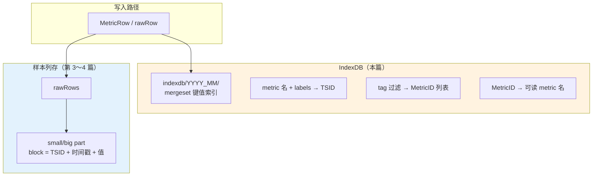
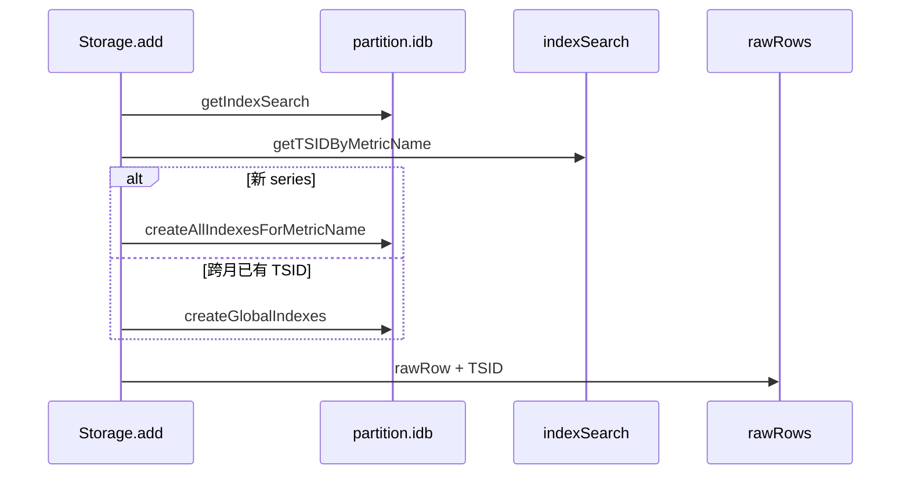
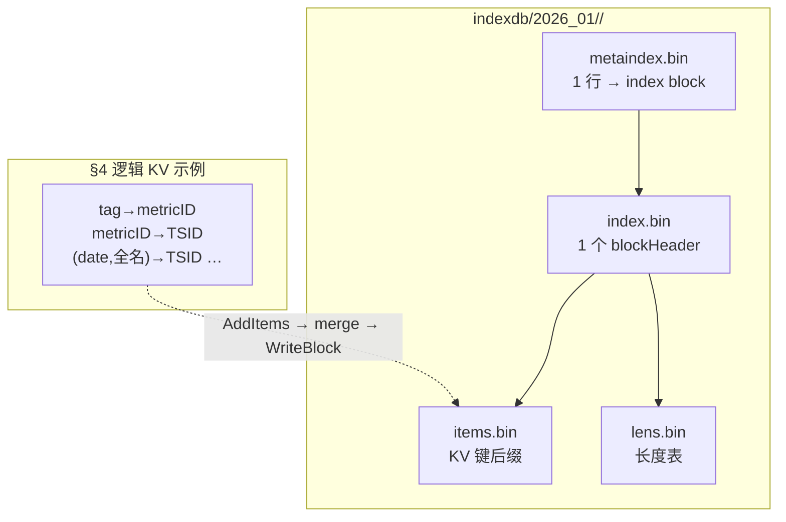
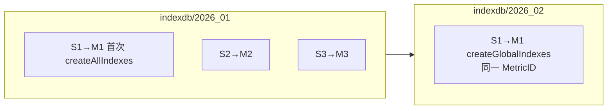

# VictoriaMetrics 写入源码解析（专题）：IndexDB 在写入链路中的作用

> **系列索引**：[README.md](./README.md)  
> **关联**：[第 2 篇](./02-vmstorage-addrows-tsid.md) 在 `Storage.add` 里解析 TSID 时会触及 IndexDB；本篇专门讲 **IndexDB 存什么、何时写、与样本 part 的分界**。  
> **本篇边界**：写入路径上的 **series 索引**（`lib/storage/index_db.go`）；**§5** 讲 IndexDB **mergeset 四文件**磁盘布局；不展开 PromQL 查询如何扫索引（见 [第 6 篇](./06-query-indexdb-series-pruning.md)），也不重复 [第 4 篇 §6.2](./04-part-block-disk.md#62-两层索引metaindex-粗筛--index-精定位) 的样本 part 两层索引细节。

> **图表预览**：见 [系列索引](./README.md#图表预览)。

---

## 1. 本篇要回答的问题

| 问题 | 本篇是否覆盖 |
|------|----------------|
| IndexDB 和 `small/` 里的 part 有什么区别？ | ✅ |
| 写入时 IndexDB 里会新增哪些记录？ | ✅ |
| 为何每个 partition 有自己的 `indexdb/2026_01/`？ | ✅ |
| `MetricNameRaw` 如何查到 TSID？ | ✅ |
| 跨月 #7 为何要在 `2026_02` 的 IndexDB 再写索引？ | ✅ |
| IndexDB part 里 `metaindex/index/items/lens.bin` 各干什么？ | ✅ |
| 样本值 0.72、1200 存在 IndexDB 吗？ | ✅（**不存**） |

---

## 2. 先划清界线：IndexDB vs 样本存储

VictoriaMetrics 把 **「这条 series 是谁」** 和 **「这条 series 的样本点」** 分开存放：



| 存储 | 路径示例 | 存什么 | 不存什么 |
|------|----------|--------|----------|
| **IndexDB** | `data/indexdb/2026_01/` | series 元数据、倒排索引（tag → metricID） | 样本 **值**、时间序列点列 |
| **样本 part** | `data/small/2026_01/<hex>/` | 按 TSID 压缩的 timestamps/values | 完整 PromQL 标签索引 |

```134:135:lib/storage/partition.go
	// Contains the inverted index for the data stored in this partition.
	idb *indexDB
```

**一句话**：IndexDB 让 VM 在写入时 **认领/创建 TSID**，在查询时 **按 label 找 series**；真正的 **0.72、1200** 进 part 里的 block。

---

## 3. IndexDB 在架构中的位置

### 3.1 每个 partition 一个 IndexDB

与 `small/2026_01`、`big/2026_01` 并列，创建 partition 时建立：

```208:215:lib/storage/partition.go
	indexDBPartsPath := filepath.Join(filepath.Clean(indexDBPath), name)
	// ...
	fs.MustMkdirFailIfExist(indexDBPartsPath)
```

```307:318:lib/storage/partition.go
func newPartition(name, smallPartsPath, bigPartsPath, indexDBPartsPath string, tr TimeRange, s *Storage) *partition {
	id := uint64(tr.MinTimestamp)
	idb := mustOpenIndexDB(id, tr, name, indexDBPartsPath, s, &s.isReadOnly, false)
	p := &partition{
		// ...
		idb: idb,
	}
```

底层是 **`mergeset.Table`**（LSM 类键值表），不是样本 part 那套 `timestamps.bin`：

```169:181:lib/storage/index_db.go
func mustOpenIndexDB(id uint64, tr TimeRange, name, path string, s *Storage, isReadOnly *atomic.Bool, noRegisterNewSeries bool) *indexDB {
	tfssCache := lrucache.NewCache(getTagFiltersCacheSize)
	tb := mergeset.MustOpenTable(path, dataFlushInterval, tfssCache.Reset, mergeTagToMetricIDsRows, isReadOnly)
	db := &indexDB{
		id:   id,
		tr:   tr,
		name: name,
		tb:   tb,
		s:    s,
		// ...
	}
```

### 3.2 写入时谁调用 IndexDB

在 [第 2 篇](./02-vmstorage-addrows-tsid.md) 的 `Storage.add` 循环里，按 **样本时间戳** 选中 partition 后，使用该 partition 的 `idb`：

```1921:1931:lib/storage/storage.go
		if ptw == nil || !ptw.pt.HasTimestamp(r.Timestamp) {
			// ...
			ptw = s.tb.MustGetPartition(r.Timestamp)
			idb = ptw.pt.idb
			is = idb.getIndexSearch(noDeadline)
			deletedMetricIDs = idb.getDeletedMetricIDs()
		}
```

随后：查 TSID → 若无则 `generateTSID` + **写 IndexDB** → 再 `rawRow.TSID = ...` 进入样本路径。



---

## 4. IndexDB 里存什么：命名空间（nsPrefix）

所有条目都是 **带前缀的 KV**，前缀区分索引类型：

```35:71:lib/storage/index_db.go
const (
	nsPrefixMetricNameToTSID = 0      // 仅 -disablePerDayIndex 时全局 metricName→TSID
	nsPrefixTagToMetricIDs = 1        // tag → metricID（全局）
	nsPrefixMetricIDToTSID = 2        // metricID → TSID
	nsPrefixMetricIDToMetricName = 3  // metricID → 完整 metric 名（含 labels）
	nsPrefixDeletedMetricID = 4
	nsPrefixDateToMetricID = 5         // 某日有哪些 metricID
	nsPrefixDateTagToMetricIDs = 6     // 某日 + tag 条件 → metricID
	nsPrefixDateMetricNameToTSID = 7    // 某日 + metricName → TSID（默认写入主路径）
)
```

**默认模式**（未开 `-disablePerDayIndex`）：新 series 主要靠 **按日** 索引；全局索引仍维护 metricID 双向表与 tag 索引。

### 4.1 全局索引：`createGlobalIndexes`

每次在新 partition 的 IndexDB 中**登记** series 时都会调用（含跨月补写）：

```428:469:lib/storage/index_db.go
func (db *indexDB) createGlobalIndexes(tsid *TSID, mn *MetricName) {
	db.metricIDCache.Set(tsid.MetricID)

	// （可选）全局 metricName → TSID：仅 disablePerDayIndex
	// ...

	// metricID → metricName
	ii.B = marshalCommonPrefix(ii.B, nsPrefixMetricIDToMetricName)
	ii.B = encoding.MarshalUint64(ii.B, tsid.MetricID)
	ii.B = mn.Marshal(ii.B)

	// metricID → TSID
	ii.B = marshalCommonPrefix(ii.B, nsPrefixMetricIDToTSID)
	ii.B = encoding.MarshalUint64(ii.B, tsid.MetricID)
	ii.B = tsid.Marshal(ii.B)

	// 每个 tag → metricID（含 __name__ 对应的 metric group）
	ii.registerTagIndexes(kb.B, mn, tsid.MetricID)

	db.tb.AddItems(ii.Items)
}
```

| 索引项 | 键（逻辑） | 值 | 用途 |
|--------|------------|-----|------|
| MetricID → MetricName | `metricID` | 编码后的 metric 名 + labels | 反查、展示、调试 |
| MetricID → TSID | `metricID` | `TSID` 结构体 | 从 ID 取完整 TSID |
| Tag → MetricIDs | `tagKey=tagValue` | `metricID` | `{job="api"}` 等匹配 |
| MetricName → TSID | 全名 | `TSID` | 仅 **disablePerDayIndex** 时 |

### 4.2 按日索引：`createPerDayIndexes`

写入样本当天（`date = timestamp / 一天毫秒数`）的索引：

```2725:2760:lib/storage/index_db.go
func (db *indexDB) createPerDayIndexes(date uint64, tsid *TSID, mn *MetricName) {
	if db.s.disablePerDayIndex {
		return
	}
	db.dateMetricIDCache.Set(date, tsid.MetricID)

	// date → metricID
	ii.B = marshalCommonPrefix(ii.B, nsPrefixDateToMetricID)
	ii.B = encoding.MarshalUint64(ii.B, date)
	ii.B = encoding.MarshalUint64(ii.B, tsid.MetricID)

	// (date, metricName) → TSID
	ii.B = marshalCommonPrefix(ii.B, nsPrefixDateMetricNameToTSID)
	ii.B = encoding.MarshalUint64(ii.B, date)
	ii.B = mn.Marshal(ii.B)
	ii.B = tsid.Marshal(ii.B)

	// (date, tag) → metricID
	ii.registerTagIndexes(kb.B, mn, tsid.MetricID)

	db.tb.AddItems(ii.Items)
}
```

**为何按日**：注释说明在高 churn、长 retention 下，按日拆分比单一全局 `metricName→TSID` 更省内存（见 `nsPrefixMetricNameToTSID` 上方注释）。

### 4.3 新 series 一次写齐

```2102:2105:lib/storage/storage.go
func createAllIndexesForMetricName(db *indexDB, mn *MetricName, tsid *TSID, date uint64) {
	db.createGlobalIndexes(tsid, mn)
	db.createPerDayIndexes(date, tsid, mn)
}
```

在 `Storage.add` 最慢路径里，IndexDB 查不到 TSID 时：

```2037:2040:lib/storage/storage.go
		generateTSID(&lTSID.TSID, mn)
		createAllIndexesForMetricName(idb, mn, &lTSID.TSID, date)
		s.putTSIDByMetricNameToCache(&lTSID, mr.MetricNameRaw)
```

---

## 5. IndexDB part 磁盘布局：mergeset 四文件

§4 讲的是 **逻辑 KV**（`nsPrefix` + 键 + 值）。落盘时，`mergeset.Table` 把它们写进 **`indexdb/YYYY_MM/<hex>/`** 目录，结构和样本 part 类似，也是 **两层索引 + 两份 payload**，只是 payload 文件不同。

### 5.1 与样本 part 的文件对照

| 角色 | 样本 part（`small/` / `big/`，[第 4 篇 §6.2](./04-part-block-disk.md#62-两层索引metaindex-粗筛--index-精定位)） | IndexDB part（`indexdb/`，本篇） |
|------|----------------------------------------------------------------|----------------------------------|
| 粗索引 | `metaindex.bin` | `metaindex.bin`（**同名，字段不同**） |
| 细索引 | `index.bin` → `blockHeader`（TSID + 数据偏移） | `index.bin` → `blockHeader`（`commonPrefix` + `firstItem` + items/lens 偏移） |
| payload A | `timestamps.bin` | **`items.bin`**（各 KV 键的后缀/增量，ZSTD 压缩） |
| payload B | `values.bin` | **`lens.bin`**（解码 items 用的长度信息，ZSTD 压缩） |
| 统计 | `metadata.json`（rows/blocks/时间范围） | `metadata.json`（`ItemsCount` / `BlocksCount` / `FirstItem` / `LastItem`） |

实现包也不同：样本 part 在 **`lib/storage`**，IndexDB part 在 **`lib/mergeset`**（`index_db.go` 里的 `tb mergeset.Table`）。

```3:9:lib/mergeset/filenames.go
const (
	metaindexFilename = "metaindex.bin"
	indexFilename     = "index.bin"
	itemsFilename     = "items.bin"
	lensFilename      = "lens.bin"
	metadataFilename  = "metadata.json"
	partsFilename     = "parts.json"
)
```

### 5.2 四个 `.bin` 各存什么（写入视角）

| 文件 | 存什么 | 何时写入 |
|------|--------|----------|
| **`items.bin`** | 每个 mergeset **block** 里，除 `commonPrefix` / `firstItem` 外，其余 sorted KV 的**键数据**（压缩块） | `WriteBlock` 每写一个 block |
| **`lens.bin`** | 与 items 配套的**长度表**（plain 或 delta 编码），读 block 时先解压 lens，再按长度切 items | 同上 |
| **`index.bin`** | 一串 **`blockHeader`**（含 items/lens 在文件内的 offset/size），多个 header 再 ZSTD 压成一个 **index block** | `indexData` 过大或 part 关闭时 flush |
| **`metaindex.bin`** | 一串 **`metaindexRow`**（指向 index block 的 offset/size + 该 block 第一个键），整体 ZSTD 压缩 | part 关闭时一次写入 |

写入顺序（`blockStreamWriter.WriteBlock`）：

```133:146:lib/mergeset/block_stream_writer.go
func (bsw *blockStreamWriter) WriteBlock(ib *inmemoryBlock) {
	// ...
	fs.MustWriteData(bsw.itemsWriter, bsw.sb.itemsData)
	bsw.bh.itemsBlockOffset = bsw.itemsBlockOffset
	bsw.itemsBlockOffset += uint64(bsw.bh.itemsBlockSize)

	fs.MustWriteData(bsw.lensWriter, bsw.sb.lensData)
	bsw.bh.lensBlockOffset = bsw.lensBlockOffset
	bsw.lensBlockOffset += uint64(bsw.bh.lensBlockSize)
	// blockHeader 追加进 indexData → 过大则 flush 到 index.bin + 写 metaindexRow
}
```

**`blockHeader` 里和 items/lens 相关的字段**（对应 §4 里一条条 KV 的物理位置）：

| 字段 | 含义 |
|------|------|
| `commonPrefix` / `firstItem` | block 内**最小键**及其与后续键的公共前缀（排序 KV 块的标准技巧） |
| `itemsCount` | 该 block 内 **KV 条数**（与 `metadata.json` 的 `ItemsCount` 一致时可对照） |
| `itemsBlockOffset` / `itemsBlockSize` | 在 **`items.bin`** 中的压缩块 |
| `lensBlockOffset` / `lensBlockSize` | 在 **`lens.bin`** 中的压缩块 |

两层索引的分工与 [第 4 篇 §6.2](./04-part-block-disk.md#62-两层索引metaindex-粗筛--index-精定位) 相同：**metaindex 粗筛 index block，index 精确定位 block，再读 payload**。差别只是 payload 从 timestamps/values 换成 items/lens。



### 5.3 示例：`indexdb/2026_01` 真实 part 里四个文件

本系列 7 个点写入并 flush 后，`indexdb/2026_01/18B328B55FF523F7/` 在磁盘上大致是：

```text
indexdb/2026_01/18B328B55FF523F7/
├── metaindex.bin     46 B
├── index.bin         52 B
├── items.bin        365 B
├── lens.bin          77 B
└── metadata.json          ← ItemsCount=35, BlocksCount=1, FirstItem/LastItem
```

三条 series（S1/S2/S3）各写一套 §4 的全局 + 按日索引，合计 **35 条 KV**，体量很小，**全在一个 mergeset block** 里（`BlocksCount=1`）。

**MetricID 与 series 对应**（blog 验证环境写入后分配的值）：

| Series | MetricID |
|--------|----------|
| S1 `cpu_usage{host="h1",job="api"}` | `1779811012211904048`（下文简称 **M1**） |
| S2 `cpu_usage{host="h2",job="api"}` | `1779811012211904049`（**M2**） |
| S3 `http_requests_total{host="h1",path="/x"}` | `1779811012211904050`（**M3**） |

#### 35 条 KV 分别是什么

下列内容用 VictoriaMetrics 源码树里的测试程序从该 part **逐条 dump** 得到（逻辑视图；磁盘上在 `items.bin` 里为压缩字节）：

```bash
cd VictoriaMetrics
DUMP_PART=1 go test ./lib/storage -run TestDumpBlogIndexDBKVs -v
# 默认 PART_PATH=/tmp/vm-blog-verify/data/indexdb/2026_01/18B328B55FF523F7
```

**A. 全局倒排 `Tag→MetricIDs`（nsPrefix=`01`，§4.1）— 12 条**

| # | 键（逻辑） | 值 |
|---|------------|-----|
| 1 | `__name__=cpu_usage` | M1 |
| 2 | `__name__=cpu_usage` | M2 |
| 3 | `__name__=http_requests_total` | M3 |
| 4 | `host=h1` | M1, M3 |
| 5 | `host=h2` | M2 |
| 6 | `job=api` | M1, M2 |
| 7 | `path=/x` | M3 |
| 8 | `__name__+tag{metric=cpu_usage,key=host}=h1` | M1 |
| 9 | `__name__+tag{metric=cpu_usage,key=host}=h2` | M2 |
| 10 | `__name__+tag{metric=cpu_usage,key=job}=api` | M1, M2 |
| 11 | `__name__+tag{metric=http_requests_total,key=host}=h1` | M3 |
| 12 | `__name__+tag{metric=http_requests_total,key=path}=/x` | M3 |

第 8～12 行是 **composite tag** 索引（`compositeTagKeyPrefix=0xfe`），加速带 `{__name__="…"}` 的 PromQL 过滤。

**B. 全局正向 `MetricID→TSID` / `MetricID→MetricName`（nsPrefix=`02` / `03`）— 各 3 条**

| # | 键 | 值 |
|---|-----|-----|
| 13 | M1 | TSID(M1) |
| 14 | M2 | TSID(M2) |
| 15 | M3 | TSID(M3) |
| 16 | M1 | `cpu_usage{job="api",host="h1"}` |
| 17 | M2 | `cpu_usage{job="api",host="h2"}` |
| 18 | M3 | `http_requests_total{host="h1",path="/x"}` |

**C. 按日 `Date→MetricID`（nsPrefix=`05`，date=`2026-01-15`）— 3 条**

| # | 键 | 值 |
|---|-----|-----|
| 19 | `2026-01-15` | M1 |
| 20 | `2026-01-15` | M2 |
| 21 | `2026-01-15` | M3 |

**D. 按日倒排 `(Date,Tag)→MetricIDs`（nsPrefix=`06`，date=`2026-01-15`）— 11 条**

与 A 组同构，只是每条键前多了 **date**；例如 #24 表示「2026-01-15 当天、`host=h1` 的 series」→ M1 与 M3（S1 与 S3 都含 `host=h1`）。

| # | 键（逻辑） | 值 |
|---|------------|-----|
| 22 | `(2026-01-15, __name__=cpu_usage)` | M1, M2 |
| 23 | `(2026-01-15, __name__=http_requests_total)` | M3 |
| 24 | `(2026-01-15, host=h1)` | M1, M3 |
| 25 | `(2026-01-15, host=h2)` | M2 |
| 26 | `(2026-01-15, job=api)` | M1, M2 |
| 27 | `(2026-01-15, path=/x)` | M3 |
| 28～32 | `(2026-01-15, composite…)` | 与 #8～12 相同，各带 date 前缀 |

**E. 按日正向 `(Date,MetricName)→TSID`（nsPrefix=`07`）— 3 条**

写入时 `getTSIDByMetricName(..., date)` 走的主路径（§6.2）：

| # | 键 | 值 |
|---|-----|-----|
| 33 | `(2026-01-15, cpu_usage{job="api",host="h1"})` | TSID(M1) |
| 34 | `(2026-01-15, cpu_usage{job="api",host="h2"})` | TSID(M2) |
| 35 | `(2026-01-15, http_requests_total{host="h1",path="/x"})` | TSID(M3) |

`metadata.json` 的 **`LastItem`** 即 #35 的完整编码（以 `07` 开头）。

**小结**：35 = 12 全局 tag + 3×2 全局正向 + 3 按日登记 + 11 按日 tag + 3 按日 metricName→TSID。样本 **值**（0.72 等）不在其中——它们只在 `small/` 的 timestamps/values 里。

**第 1 层：`metaindex.bin` 解压后 1 行**

| 字段 | 本 part 实际值 | 怎么读 |
|------|----------------|--------|
| `firstItem`（十六进制） | `01016370755f75736167650118b328af8e380e30` | 整个 part 里**字典序最小**的键；首字节 `01` = `nsPrefixTagToMetricIDs`（§4.1 的 tag→metricID） |
| `blockHeadersCount` | `1` | 只有 1 个 mergeset block |
| `indexBlockOffset` | `0` | 从 `index.bin` 文件头读 |
| `indexBlockSize` | `52` | 读 52 字节 → ZSTD 解压 → 1 条 `blockHeader` |

**第 2 层：`index.bin` 解压后 1 条 blockHeader**

| 字段 | 本 part 实际值 | 怎么读 |
|------|----------------|--------|
| `firstItem` | 与 metaindex 的 `firstItem` 相同 | 该 block 的第一条 KV 键 |
| `itemsCount` | `35` | 本 block 共 **35 条 KV**（与 `metadata.json` 的 `ItemsCount` 一致） |
| `itemsBlockOffset` / `itemsBlockSize` | `0` / `365` | 到 **`items.bin`** 读 365 字节并解压 |
| `lensBlockOffset` / `lensBlockSize` | `0` / `77` | 到 **`lens.bin`** 读 77 字节并解压 |

**第 3 层：`items.bin` + `lens.bin`**

解压 lens 得到每条键后缀的长度，再按长度从 items 里切出数据，拼上 `commonPrefix` / `firstItem` 还原完整 KV 键，进而读出 §4 里的值（`metricID`、`TSID` 等）。  
`metadata.json` 的 **`LastItem`** 十六进制以 `07` 开头，对应 `nsPrefixDateMetricNameToTSID`——即按日的 `(date, 全名) → TSID` 键，与 §4.2 一致。

```text
查询 host="h1" 时（见第 6 篇，阶段 2～3）

  metaindex[0]  firstItem 定位到含 tag 键的 index block
       ↓ ReadAt index.bin[0:52]
  blockHeader   items@0:365  +  lens@0:77
       ↓ 前缀扫描 / Seek
  命中 (date, host=h1) → metricID 等 KV
       ↓
  metricID → TSID（仍在同一 mergeset part 的 KV 里）
```

IndexDB part 变大后会出现 **多行 metaindex + 多个 blockHeader**（与 [第 4 篇 §6.2 多行 metaindex 示例](./04-part-block-disk.md#part-变大时metaindex-会出现多行) 同理）；查询先用 `firstItem` 跳过整段 block，再只对候选 block 读 items/lens。

**边界**：PromQL 如何扫这些 KV（阶段 2～3）见 [第 6 篇](./06-query-indexdb-series-pruning.md)；样本 block 定位见 [第 7 篇](./07-query-part-block-pruning.md)。

---

## 6. 写入时如何查 TSID：先缓存，再 IndexDB

### 6.1 Storage 级 `tsidCache`（跨 partition）

```1967:1971:lib/storage/storage.go
		if s.getTSIDByMetricNameFromCache(&lTSID, mr.MetricNameRaw) && !deletedMetricIDs.Has(lTSID.TSID.MetricID) {
			r.TSID = lTSID.TSID
```

键是 **`MetricNameRaw` 字节**，与 partition 无关；因此 S1 在 1 月创建后，2 月 #7 仍可命中 **同一 TSID**。

### 6.2 IndexDB 内 `getTSIDByMetricName`

缓存未命中时，在**当前样本所在 partition 的 IndexDB** 中查（默认带 **date** 前缀）：

```1873:1906:lib/storage/index_db.go
func (is *indexSearch) getTSIDByMetricName(dst *TSID, metricName []byte, date uint64) bool {
	if is.db.s.disablePerDayIndex {
		kb.B = marshalCommonPrefix(kb.B[:0], nsPrefixMetricNameToTSID)
	} else {
		kb.B = marshalCommonPrefix(kb.B[:0], nsPrefixDateMetricNameToTSID)
		kb.B = encoding.MarshalUint64(kb.B, date)
	}
	kb.B = append(kb.B, metricName...)
	// mergeset 前缀扫描 → 反序列化 TSID
}
```

### 6.3 IndexDB 内辅助缓存（写入加速）

| 缓存 | 作用 |
|------|------|
| `metricIDCache` | 已知在本 IndexDB 登记过的 metricID |
| `dateMetricIDCache` | 某日是否已有某 metricID 的按日索引 |

见 `indexDB` 结构体字段注释（`index_db.go` 约 131～144 行）。

---

## 7. 贯穿示例：三条 series 写入 IndexDB 时发生什么

沿用系列示例（[README](./README.md#贯穿示例全系列统一)）。

### 7.1 首次见到 S1（样本 #1，`2026_01`）

1. `MustGetPartition` → `pt.idb` = **`indexdb/2026_01`**  
2. `tsidCache` 未命中 → `getTSIDByMetricName(..., date=2026-01-15 对应日序)` 未命中  
3. `generateTSID` → 分配 **M1**  
4. `createAllIndexesForMetricName` 写入（逻辑上）：

| 类型 | 示例内容 |
|------|----------|
| 全局 | `M1 → cpu_usage{host="h1",job="api"}`；`M1 → TSID`；`host=h1→M1`；`job=api→M1`；… |
| 按日 | `date(D) → M1`；`(D, 全名) → TSID`；`(D, host=h1) → M1`；… |

5. 样本进入 **rawRows**（值 0.72 不进 IndexDB）

### 7.2 S2、S3（#3、#5）

同样走最慢路径，得到 **M2**、**M3**，各自一套全局 + 按日索引。

### 7.3 同 partition 后续点（#2、#4、#6）

- 与上一行 **相同 `MetricNameRaw`**：可走 `prevMetricNameRaw` 快路径，**不再扫 IndexDB**（第 2 篇）。  
- IndexDB **不重复**创建 TSID；按日索引若需补全，由 `updatePerDateData` 等逻辑处理（超出本篇，见 `storage.go` 中 `add` 尾部）。

### 7.4 跨月 #7（S1，`2026_02`）

1. `MustGetPartition` → **`indexdb/2026_02`**（与 `2026_01` **不是同一个** `mergeset.Table`）  
2. `tsidCache` 仍有 S1 → **TSID 仍为 M1**  
3. `is.hasMetricID(M1)` 在 2 月 IndexDB 可能为 false → **`createGlobalIndexes`**（不是新建 M1，而是在 2 月库补全局条目）：

```1974:1990:lib/storage/storage.go
			if !is.hasMetricID(lTSID.TSID.MetricID) {
				// The found TSID is from the another partition indexdb. Create it in the current partition indexdb.
				idb.createGlobalIndexes(&lTSID.TSID, mn)
```

4. 按日索引：若该 **date（2 月 3 日）** 尚未有 M1，后续 `updatePerDateData` / `createPerDayIndexes` 会补（`add` 流程后半段）。



**要点**：**MetricID（M1）全库唯一**；**IndexDB 按 partition 分库**，跨月要在新 partition 的 IndexDB **复制/补登记** 索引，样本 part 也进 `2026_02` 的 `small/`（第 4 篇）。

---

## 8. IndexDB 不参与的写入环节

| 环节 | 是否写 IndexDB |
|------|----------------|
| vminsert 编码 `MetricNameRaw` | ❌ |
| rawRows 缓冲 | ❌ |
| inmemory / small part 写 block | ❌（只用 **已确定的 TSID**） |
| `RegisterMetricNames` API | ✅（只注册名，不写样本） |

样本写入 part 时，block 头里带 `TSID`，查询样本时通过 IndexDB 先解析出要查哪些 `MetricID`：

```19:22:lib/storage/block_header.go
type blockHeader struct {
	TSID TSID
```

---

## 9. 与 Prometheus 概念的对应

| Prometheus | IndexDB 侧 |
|------------|------------|
| 一条 series（labels 集合） | 一个 `MetricID` / `TSID` + 多条索引 KV |
| 高基数 label 组合 | 更多 `Tag→MetricID`、按日条目 |
| `__name__` | 存在 `MetricName.MetricGroup` 与 tag 索引里 |
| 样本 value | **只在 part**，不在 IndexDB |

---

## 10. 本篇小结

1. **IndexDB** = 每个 **partition** 下的 **series 倒排索引**（`indexdb/YYYY_MM/` + `mergeset`），与 **样本 part** 分离。  
2. **磁盘上**是 **metaindex / index / items / lens** 四文件；§4 的 KV 落在 **items+lens**，两层索引定位 block（§5）。  
3. **写入时**在 `Storage.add` 中：查/建 **TSID**，通过 `createGlobalIndexes` + `createPerDayIndexes` 写入 KV。  
4. **默认**用 **按日** `metricName→TSID`；全局保留 **metricID↔名**、**tag→metricID**。  
5. **示例**：S1/S2/S3 → M1/M2/M3 各建一套；#7 跨月复用 M1，但在 **`2026_02` IndexDB** 需 `createGlobalIndexes` 补登记。

---

## 11. 系列内阅读建议

| 想了解 | 阅读 |
|--------|------|
| TSID 结构与 partition 切换 | [第 2 篇](./02-vmstorage-addrows-tsid.md) |
| 样本 part 两层索引（timestamps/values） | [第 4 篇 §6.2](./04-part-block-disk.md#62-两层索引metaindex-粗筛--index-精定位) |
| IndexDB 四文件与 items/lens | **本篇 §5** |
| 查询时扫 IndexDB KV | [第 6 篇](./06-query-indexdb-series-pruning.md) |
| 样本落盘目录 | [第 4 篇](./04-part-block-disk.md) |
| 写入 flags / 查不到数据 | 第 6 篇（计划：FAQ） |

---

## 附录：系列目录（含本篇专题）

| 篇 | 文件 | 主题 |
|----|------|------|
| 1～4 | [01](./01-vminsert-remote-write.md)～[04](./04-part-block-disk.md) | 写入主路径 |
| **专题** | **本文** | IndexDB 与写入 |
| 5 | *计划* | 写入参数与 FAQ |

完整索引：[README.md](./README.md)
