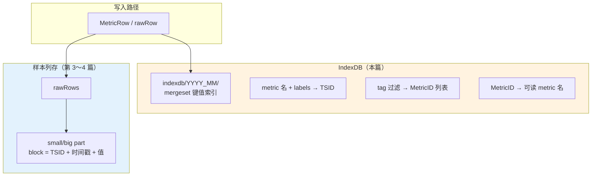
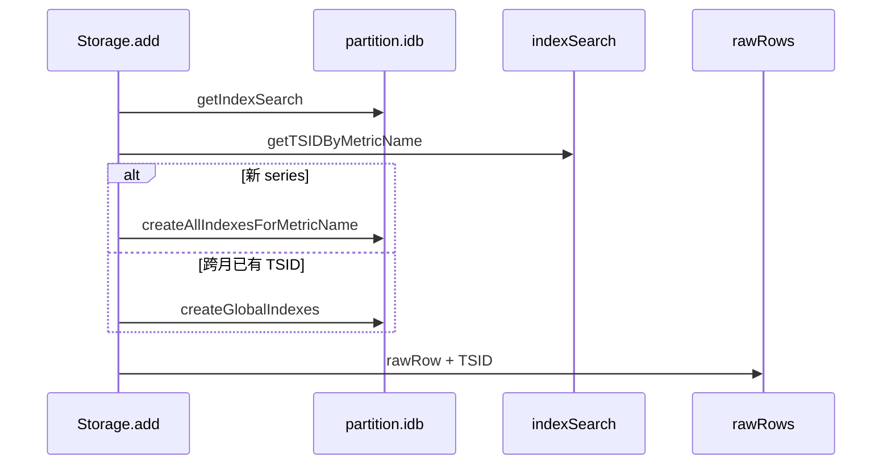
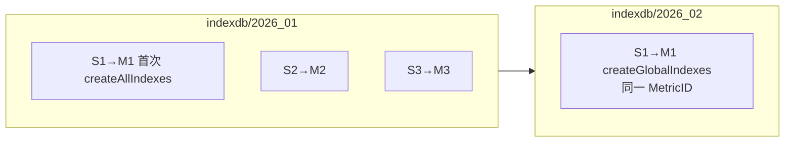

# VictoriaMetrics 写入源码解析（专题）：IndexDB 在写入链路中的作用

> **系列索引**：[README.md](./README.md)  
> **关联**：[第 2 篇](./02-vmstorage-addrows-tsid.md) 在 `Storage.add` 里解析 TSID 时会触及 IndexDB；本篇专门讲 **IndexDB 存什么、何时写、与样本 part 的分界**。  
> **本篇边界**：写入路径上的 **series 索引**（`lib/storage/index_db.go`）；不展开 PromQL 查询如何扫索引、也不重复 [第 4 篇](./04-part-block-disk.md) 的样本 part 文件格式。

> **图表预览**：见 [系列索引](./README.md#图表预览)。

---

## 1. 本篇要回答的问题

| 问题 | 本篇是否覆盖 |
|------|----------------|
| IndexDB 和 `small/` 里的 part 有什么区别？ | ✅ |
| 写入时 IndexDB 里会新增哪些记录？ | ✅ |
| 为何每个 partition 有自己的 `indexdb/2026_01/`？ | ✅ |
| `MetricNameRaw` 如何查到 TSID？ | ✅ |
| 跨月 #7 为何要在 `2026_02` 的 IndexDB 再写索引？ | ✅ |
| 样本值 0.72、1200 存在 IndexDB 吗？ | ✅（**不存**） |

---

## 2. 先划清界线：IndexDB vs 样本存储

VictoriaMetrics 把 **「这条 series 是谁」** 和 **「这条 series 的样本点」** 分开存放：



| 存储 | 路径示例 | 存什么 | 不存什么 |
|------|----------|--------|----------|
| **IndexDB** | `data/indexdb/2026_01/` | series 元数据、倒排索引（tag → metricID） | 样本 **值**、时间序列点列 |
| **样本 part** | `data/small/2026_01/<hex>/` | 按 TSID 压缩的 timestamps/values | 完整 PromQL 标签索引 |

```134:135:lib/storage/partition.go
	// Contains the inverted index for the data stored in this partition.
	idb *indexDB
```

**一句话**：IndexDB 让 VM 在写入时 **认领/创建 TSID**，在查询时 **按 label 找 series**；真正的 **0.72、1200** 进 part 里的 block。

---

## 3. IndexDB 在架构中的位置

### 3.1 每个 partition 一个 IndexDB

与 `small/2026_01`、`big/2026_01` 并列，创建 partition 时建立：

```208:215:lib/storage/partition.go
	indexDBPartsPath := filepath.Join(filepath.Clean(indexDBPath), name)
	// ...
	fs.MustMkdirFailIfExist(indexDBPartsPath)
```

```307:318:lib/storage/partition.go
func newPartition(name, smallPartsPath, bigPartsPath, indexDBPartsPath string, tr TimeRange, s *Storage) *partition {
	id := uint64(tr.MinTimestamp)
	idb := mustOpenIndexDB(id, tr, name, indexDBPartsPath, s, &s.isReadOnly, false)
	p := &partition{
		// ...
		idb: idb,
	}
```

底层是 **`mergeset.Table`**（LSM 类键值表），不是样本 part 那套 `timestamps.bin`：

```169:181:lib/storage/index_db.go
func mustOpenIndexDB(id uint64, tr TimeRange, name, path string, s *Storage, isReadOnly *atomic.Bool, noRegisterNewSeries bool) *indexDB {
	tfssCache := lrucache.NewCache(getTagFiltersCacheSize)
	tb := mergeset.MustOpenTable(path, dataFlushInterval, tfssCache.Reset, mergeTagToMetricIDsRows, isReadOnly)
	db := &indexDB{
		id:   id,
		tr:   tr,
		name: name,
		tb:   tb,
		s:    s,
		// ...
	}
```

### 3.2 写入时谁调用 IndexDB

在 [第 2 篇](./02-vmstorage-addrows-tsid.md) 的 `Storage.add` 循环里，按 **样本时间戳** 选中 partition 后，使用该 partition 的 `idb`：

```1921:1931:lib/storage/storage.go
		if ptw == nil || !ptw.pt.HasTimestamp(r.Timestamp) {
			// ...
			ptw = s.tb.MustGetPartition(r.Timestamp)
			idb = ptw.pt.idb
			is = idb.getIndexSearch(noDeadline)
			deletedMetricIDs = idb.getDeletedMetricIDs()
		}
```

随后：查 TSID → 若无则 `generateTSID` + **写 IndexDB** → 再 `rawRow.TSID = ...` 进入样本路径。



---

## 4. IndexDB 里存什么：命名空间（nsPrefix）

所有条目都是 **带前缀的 KV**，前缀区分索引类型：

```35:71:lib/storage/index_db.go
const (
	nsPrefixMetricNameToTSID = 0      // 仅 -disablePerDayIndex 时全局 metricName→TSID
	nsPrefixTagToMetricIDs = 1        // tag → metricID（全局）
	nsPrefixMetricIDToTSID = 2        // metricID → TSID
	nsPrefixMetricIDToMetricName = 3  // metricID → 完整 metric 名（含 labels）
	nsPrefixDeletedMetricID = 4
	nsPrefixDateToMetricID = 5         // 某日有哪些 metricID
	nsPrefixDateTagToMetricIDs = 6     // 某日 + tag 条件 → metricID
	nsPrefixDateMetricNameToTSID = 7    // 某日 + metricName → TSID（默认写入主路径）
)
```

**默认模式**（未开 `-disablePerDayIndex`）：新 series 主要靠 **按日** 索引；全局索引仍维护 metricID 双向表与 tag 索引。

### 4.1 全局索引：`createGlobalIndexes`

每次在新 partition 的 IndexDB 中**登记** series 时都会调用（含跨月补写）：

```428:469:lib/storage/index_db.go
func (db *indexDB) createGlobalIndexes(tsid *TSID, mn *MetricName) {
	db.metricIDCache.Set(tsid.MetricID)

	// （可选）全局 metricName → TSID：仅 disablePerDayIndex
	// ...

	// metricID → metricName
	ii.B = marshalCommonPrefix(ii.B, nsPrefixMetricIDToMetricName)
	ii.B = encoding.MarshalUint64(ii.B, tsid.MetricID)
	ii.B = mn.Marshal(ii.B)

	// metricID → TSID
	ii.B = marshalCommonPrefix(ii.B, nsPrefixMetricIDToTSID)
	ii.B = encoding.MarshalUint64(ii.B, tsid.MetricID)
	ii.B = tsid.Marshal(ii.B)

	// 每个 tag → metricID（含 __name__ 对应的 metric group）
	ii.registerTagIndexes(kb.B, mn, tsid.MetricID)

	db.tb.AddItems(ii.Items)
}
```

| 索引项 | 键（逻辑） | 值 | 用途 |
|--------|------------|-----|------|
| MetricID → MetricName | `metricID` | 编码后的 metric 名 + labels | 反查、展示、调试 |
| MetricID → TSID | `metricID` | `TSID` 结构体 | 从 ID 取完整 TSID |
| Tag → MetricIDs | `tagKey=tagValue` | `metricID` | `{job="api"}` 等匹配 |
| MetricName → TSID | 全名 | `TSID` | 仅 **disablePerDayIndex** 时 |

### 4.2 按日索引：`createPerDayIndexes`

写入样本当天（`date = timestamp / 一天毫秒数`）的索引：

```2725:2760:lib/storage/index_db.go
func (db *indexDB) createPerDayIndexes(date uint64, tsid *TSID, mn *MetricName) {
	if db.s.disablePerDayIndex {
		return
	}
	db.dateMetricIDCache.Set(date, tsid.MetricID)

	// date → metricID
	ii.B = marshalCommonPrefix(ii.B, nsPrefixDateToMetricID)
	ii.B = encoding.MarshalUint64(ii.B, date)
	ii.B = encoding.MarshalUint64(ii.B, tsid.MetricID)

	// (date, metricName) → TSID
	ii.B = marshalCommonPrefix(ii.B, nsPrefixDateMetricNameToTSID)
	ii.B = encoding.MarshalUint64(ii.B, date)
	ii.B = mn.Marshal(ii.B)
	ii.B = tsid.Marshal(ii.B)

	// (date, tag) → metricID
	ii.registerTagIndexes(kb.B, mn, tsid.MetricID)

	db.tb.AddItems(ii.Items)
}
```

**为何按日**：注释说明在高 churn、长 retention 下，按日拆分比单一全局 `metricName→TSID` 更省内存（见 `nsPrefixMetricNameToTSID` 上方注释）。

### 4.3 新 series 一次写齐

```2102:2105:lib/storage/storage.go
func createAllIndexesForMetricName(db *indexDB, mn *MetricName, tsid *TSID, date uint64) {
	db.createGlobalIndexes(tsid, mn)
	db.createPerDayIndexes(date, tsid, mn)
}
```

在 `Storage.add` 最慢路径里，IndexDB 查不到 TSID 时：

```2037:2040:lib/storage/storage.go
		generateTSID(&lTSID.TSID, mn)
		createAllIndexesForMetricName(idb, mn, &lTSID.TSID, date)
		s.putTSIDByMetricNameToCache(&lTSID, mr.MetricNameRaw)
```

---

## 5. 写入时如何查 TSID：先缓存，再 IndexDB

### 5.1 Storage 级 `tsidCache`（跨 partition）

```1967:1971:lib/storage/storage.go
		if s.getTSIDByMetricNameFromCache(&lTSID, mr.MetricNameRaw) && !deletedMetricIDs.Has(lTSID.TSID.MetricID) {
			r.TSID = lTSID.TSID
```

键是 **`MetricNameRaw` 字节**，与 partition 无关；因此 S1 在 1 月创建后，2 月 #7 仍可命中 **同一 TSID**。

### 5.2 IndexDB 内 `getTSIDByMetricName`

缓存未命中时，在**当前样本所在 partition 的 IndexDB** 中查（默认带 **date** 前缀）：

```1873:1906:lib/storage/index_db.go
func (is *indexSearch) getTSIDByMetricName(dst *TSID, metricName []byte, date uint64) bool {
	if is.db.s.disablePerDayIndex {
		kb.B = marshalCommonPrefix(kb.B[:0], nsPrefixMetricNameToTSID)
	} else {
		kb.B = marshalCommonPrefix(kb.B[:0], nsPrefixDateMetricNameToTSID)
		kb.B = encoding.MarshalUint64(kb.B, date)
	}
	kb.B = append(kb.B, metricName...)
	// mergeset 前缀扫描 → 反序列化 TSID
}
```

### 5.3 IndexDB 内辅助缓存（写入加速）

| 缓存 | 作用 |
|------|------|
| `metricIDCache` | 已知在本 IndexDB 登记过的 metricID |
| `dateMetricIDCache` | 某日是否已有某 metricID 的按日索引 |

见 `indexDB` 结构体字段注释（`index_db.go` 约 131～144 行）。

---

## 6. 贯穿示例：三条 series 写入 IndexDB 时发生什么

沿用系列示例（[README](./README.md#贯穿示例全系列统一)）。

### 6.1 首次见到 S1（样本 #1，`2026_01`）

1. `MustGetPartition` → `pt.idb` = **`indexdb/2026_01`**  
2. `tsidCache` 未命中 → `getTSIDByMetricName(..., date=2026-01-15 对应日序)` 未命中  
3. `generateTSID` → 分配 **M1**  
4. `createAllIndexesForMetricName` 写入（逻辑上）：

| 类型 | 示例内容 |
|------|----------|
| 全局 | `M1 → cpu_usage{host="h1",job="api"}`；`M1 → TSID`；`host=h1→M1`；`job=api→M1`；… |
| 按日 | `date(D) → M1`；`(D, 全名) → TSID`；`(D, host=h1) → M1`；… |

5. 样本进入 **rawRows**（值 0.72 不进 IndexDB）

### 6.2 S2、S3（#3、#5）

同样走最慢路径，得到 **M2**、**M3**，各自一套全局 + 按日索引。

### 6.3 同 partition 后续点（#2、#4、#6）

- 与上一行 **相同 `MetricNameRaw`**：可走 `prevMetricNameRaw` 快路径，**不再扫 IndexDB**（第 2 篇）。  
- IndexDB **不重复**创建 TSID；按日索引若需补全，由 `updatePerDateData` 等逻辑处理（超出本篇，见 `storage.go` 中 `add` 尾部）。

### 6.4 跨月 #7（S1，`2026_02`）

1. `MustGetPartition` → **`indexdb/2026_02`**（与 `2026_01` **不是同一个** `mergeset.Table`）  
2. `tsidCache` 仍有 S1 → **TSID 仍为 M1**  
3. `is.hasMetricID(M1)` 在 2 月 IndexDB 可能为 false → **`createGlobalIndexes`**（不是新建 M1，而是在 2 月库补全局条目）：

```1974:1990:lib/storage/storage.go
			if !is.hasMetricID(lTSID.TSID.MetricID) {
				// The found TSID is from the another partition indexdb. Create it in the current partition indexdb.
				idb.createGlobalIndexes(&lTSID.TSID, mn)
```

4. 按日索引：若该 **date（2 月 3 日）** 尚未有 M1，后续 `updatePerDateData` / `createPerDayIndexes` 会补（`add` 流程后半段）。



**要点**：**MetricID（M1）全库唯一**；**IndexDB 按 partition 分库**，跨月要在新 partition 的 IndexDB **复制/补登记** 索引，样本 part 也进 `2026_02` 的 `small/`（第 4 篇）。

---

## 7. IndexDB 不参与的写入环节

| 环节 | 是否写 IndexDB |
|------|----------------|
| vminsert 编码 `MetricNameRaw` | ❌ |
| rawRows 缓冲 | ❌ |
| inmemory / small part 写 block | ❌（只用 **已确定的 TSID**） |
| `RegisterMetricNames` API | ✅（只注册名，不写样本） |

样本写入 part 时，block 头里带 `TSID`，查询样本时通过 IndexDB 先解析出要查哪些 `MetricID`：

```19:22:lib/storage/block_header.go
type blockHeader struct {
	TSID TSID
```

---

## 8. 与 Prometheus 概念的对应

| Prometheus | IndexDB 侧 |
|------------|------------|
| 一条 series（labels 集合） | 一个 `MetricID` / `TSID` + 多条索引 KV |
| 高基数 label 组合 | 更多 `Tag→MetricID`、按日条目 |
| `__name__` | 存在 `MetricName.MetricGroup` 与 tag 索引里 |
| 样本 value | **只在 part**，不在 IndexDB |

---

## 9. 本篇小结

1. **IndexDB** = 每个 **partition** 下的 **series 倒排索引**（`indexdb/YYYY_MM/` + `mergeset`），与 **样本 part** 分离。  
2. **写入时**在 `Storage.add` 中：查/建 **TSID**，通过 `createGlobalIndexes` + `createPerDayIndexes` 写入 KV。  
3. **默认**用 **按日** `metricName→TSID`；全局保留 **metricID↔名**、**tag→metricID**。  
4. **示例**：S1/S2/S3 → M1/M2/M3 各建一套；#7 跨月复用 M1，但在 **`2026_02` IndexDB** 需 `createGlobalIndexes` 补登记。

---

## 10. 系列内阅读建议

| 想了解 | 阅读 |
|--------|------|
| TSID 结构与 partition 切换 | [第 2 篇](./02-vmstorage-addrows-tsid.md) |
| 样本落盘目录 | [第 4 篇](./04-part-block-disk.md) |
| 写入 flags / 查不到数据 | 第 6 篇（计划：FAQ） |

---

## 附录：系列目录（含本篇专题）

| 篇 | 文件 | 主题 |
|----|------|------|
| 1～4 | [01](./01-vminsert-remote-write.md)～[04](./04-part-block-disk.md) | 写入主路径 |
| **专题** | **本文** | IndexDB 与写入 |
| 5 | *计划* | 写入参数与 FAQ |

完整索引：[README.md](./README.md)
