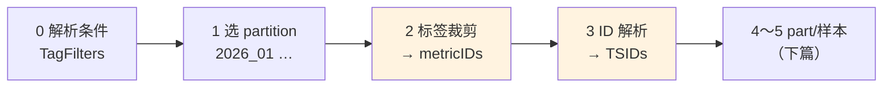
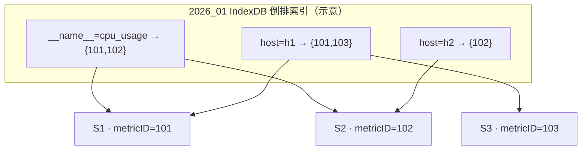
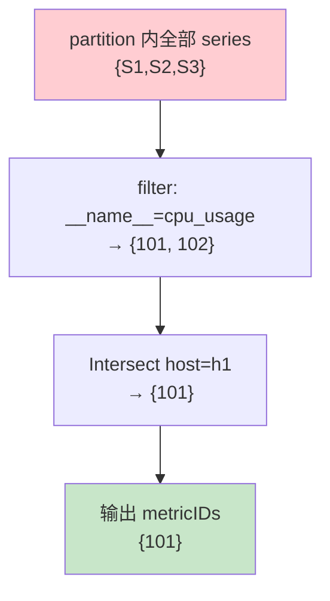
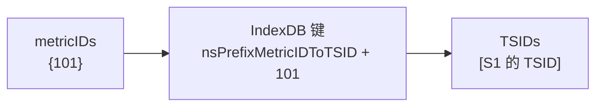

# VictoriaMetrics 查询源码解析（一）：IndexDB 如何裁掉无关 series

> **系列索引**：[README.md](./README.md)  
> **写入侧对照**：[05-indexdb-write-path.md](./05-indexdb-write-path.md) — IndexDB 里存什么、键空间长什么样  
> **下篇**：[07-query-part-block-pruning.md](./07-query-part-block-pruning.md) — TSID 确定之后，part/block 怎么继续裁  
> **本篇边界**：**IndexDB 的 series 裁剪** — 用 PromQL 标签在倒排索引里筛出 **metricIDs**，再查成 **TSIDs**；不展开磁盘 part/block 读取和样本点过滤。  
> 下文把查询裁剪拆成五段（阶段 0～5），**本篇对应阶段 2 和 3**，路线图见 [§1](#1-查询裁剪分五段这篇讲哪两段)。

> **图表预览**：见 [系列索引](./README.md#图表预览)。

---

## 1. 查询裁剪分五段：这篇讲哪两段

VictoriaMetrics 处理一条 PromQL 查询时，存储层会**从粗到细**裁五次。先记住这张表，后文提到的「阶段 N」都指这里：

| 阶段 | 在干什么 | 裁什么 | 本篇 |
|------|----------|--------|------|
| **0** | PromQL 解析 → `TagFilters` + `TimeRange` | —（只是翻译查询条件） | 略提 |
| **1** | 按时间选 **partition**（按月目录，如 `2026_01`） | 与查询时间无关的整月 partition | 略提 |
| **2** | IndexDB 倒排索引：**标签 → metricIDs** | 标签不匹配的 series | **✅ 核心** |
| **3** | IndexDB 正向索引：**metricID → TSID** | 索引损坏/缺失的 metricID | **✅ 核心** |
| **4** | part / metaindex / block header 定位 | 时间或 TSID 不相关的 block | ❌ 下篇 |
| **5** | 解压 block，按时间窗口裁样本点 | 窗口外的 timestamp | ❌ 下篇 |



**阶段 2 + 3 合起来，就是 IndexDB 在查询里的全部工作**：不负责读具体样本值（比如写入示例里的 `0.72`、`1200`），只回答——**这次查询到底涉及哪几条 series？** 答完把 **TSID 白名单**交给后面的 part 搜索（阶段 4 起）。

---

## 2. 贯穿示例（与写入系列相同）

后文用三条 **series**（时间序列）做演示，代号 **S1 / S2 / S3**。若你读过 [写入系列](./README.md)，它们是同一批示例数据；没读过也没关系，记住下表即可：

- **metricID**：series 的逻辑编号，一条 series 一个（写入时分配）。
- **partition**：按样本时间戳划分的月目录（如 `2026_01`），各自有 IndexDB 和样本 part。
- S1 有一个跨月样本 #7 落在 `2026_02`，但 **metricID 不变**——本篇查询窗口在 1 月 15 日，不会碰到 #7。

| ID | PromQL | MetricID（示意） | 写入 partition |
|----|--------|------------------|----------------|
| **S1** | `cpu_usage{host="h1",job="api"}` | 101 | #1～#6 → `2026_01`；#7 → `2026_02` |
| **S2** | `cpu_usage{host="h2",job="api"}` | 102 | `2026_01` |
| **S3** | `http_requests_total{host="h1",path="/x"}` | 103 | `2026_01` |

**本篇用的查询**：

```promql
cpu_usage{host="h1"}
```

时间范围：`2026-01-15 10:00:00` ~ `2026-01-15 10:05:00`（UTC）。

期望结果：只命中 **S1**。**阶段 2**（见 §1 表格：标签 → metricIDs）会把 S2、S3 排除；阶段 4 的 part 搜索不会为它们打开 block。

---

## 3. 本篇要回答的问题

| 问题 | 本篇是否覆盖 |
|------|----------------|
| `{host="h1"}` 怎么把无关 series（S2、S3）排除掉？ | ✅ |
| IndexDB 倒排索引在查询时怎么用？ | ✅ |
| metricID 和 TSID 有什么区别、查询时各干什么？ | ✅ |
| 查询时间范围如何缩小 IndexDB 扫描范围？ | ✅ |
| block 读不读、样本点怎么裁？ | ❌ 下篇（阶段 4～5） |

---

## 4. 查询怎么走到 IndexDB

### 4.1 从 PromQL 到 TagFilters（阶段 0）

vmselect 执行带时间范围的 PromQL（如 `query_range`、`rate(...[5m])`）时，会把 metric selector 转成 storage 内部的 **`TagFilters`**（一组标签匹配条件），再打包成 `SearchQuery`：

```1698:1710:app/vmselect/promql/eval.go
	tfss := searchutil.ToTagFilterss(me.LabelFilterss)
	tfss = searchutil.JoinTagFilterss(tfss, ec.EnforcedTagFilterss)
	// ... rollup 会适当向前扩展 minTimestamp ...
	sq := storage.NewSearchQuery(minTimestamp, ec.End, tfss, ec.MaxSeries)
	rss, err := netstorage.ProcessSearchQuery(qt, sq, ec.Deadline)
```

对我们的例子，`cpu_usage{host="h1"}` 会变成两个正向 filter（逻辑上）：

| filter | 含义 |
|--------|------|
| `{__name__="cpu_usage"}` | 指标名匹配 |
| `{host="h1"}` | 标签等值匹配 |

### 4.2 ProcessSearchQuery 触发 series 搜索

`ProcessSearchQuery` 里会初始化 `Search`，核心就一行：

```171:176:lib/storage/search.go
	tsids, err := storage.SearchTSIDs(qt, tfss, tr, maxMetrics, deadline)
	// ...
	s.ts.Init(storage.tb, tsids, tr)
```

注意顺序：**先走完阶段 2～3 得到 TSIDs，再 `tableSearch.Init`**（阶段 4 的起点）。后面的 part 扫描只认这份 TSID 白名单。

### 4.3 先选 partition，再进 IndexDB（阶段 1）

`Storage.SearchTSIDs` 会通过 `searchAndMerge` 找到与查询时间重叠的 partition，只搜这些 partition 自带的 IndexDB：

```1113:1120:lib/storage/storage.go
	ptws := s.tb.GetPartitions(tr)
	for _, ptw := range ptws {
		idbts = append(idbts, indexDBWithType{
			idb: ptw.pt.idb,
			t:   indexDBTypePt,
		})
	}
```

对我们的查询（只看 1 月 15 日），**阶段 1** 只会选中 `2026_01` 这个 partition，因此只打开它的 IndexDB。S1 的跨月点 #7 在 `2026_02`，不在本次时间窗口内，连它的 IndexDB 条目都不会被扫到。阶段 1 的细节本篇不展开，但示例里值得记住。

---

## 5. 阶段 2：用标签在倒排索引里筛 metricIDs

> **阶段 2 做什么**：拿着 `TagFilters` 和 `TimeRange`，在 IndexDB 里查出所有匹配的 **metricID**；不匹配的 series 在这里被裁掉。

### 5.1 读哪套索引？

IndexDB 里有两类对查询有用的倒排索引（写入时在 [第 5 篇](./05-indexdb-write-path.md) 讲过）：

| 键前缀 | 逻辑键 | 值 |
|--------|--------|-----|
| `nsPrefixDateTagToMetricIDs` (6) | `(date, tagKey=tagValue)` | metricID |
| `nsPrefixTagToMetricIDs` (1) | `tagKey=tagValue` | metricID |

PromQL 查询几乎都带时间范围，走 **per-day 倒排索引**：

```2268:2275:lib/storage/index_db.go
	if tr != globalIndexTimeRange {
		// Fast path - search metricIDs by date range in the per-day inverted
		// index.
		minDate, maxDate := tr.DateRange()
		return is.updateMetricIDsForDateRange(qt, metricIDs, tfs, minDate, maxDate, maxMetrics)
	}
```

我们的查询只跨 **一天**（2026-01-15），走单日快路径：只在 `date = 20260115` 这一天的索引里搜，不必按天并行合并。

### 5.2 倒排索引长什么样（示意）

写入 S1/S2/S3 之后，`2026_01` IndexDB 里会有类似这样的逻辑条目（简化，只列查询相关的 tag）：

```text
(date=20260115, __name__=cpu_usage)  →  {101, 102}
(date=20260115, host=h1)               →  {101, 103}
(date=20260115, host=h2)               →  {102}
(date=20260115, __name__=http_requests_total) → {103}
```



样本值 0.72、1200 **不在这里**。IndexDB 只维护「哪个 tag 对应哪些 metricID」。

### 5.3 filter 求交：一步一步裁

核心函数是 `getMetricIDsForDateAndFilters`。逻辑不复杂，就是**先拿一个最小的集合，再逐个 filter 求交或做差**。

对我们的查询 `{__name__="cpu_usage", host="h1"}`，在 `date=20260115` 上：

**Step 1 — 选第一个正向 filter，扫倒排索引**

假设先扫 `{__name__="cpu_usage"}`：

```text
metricIDs = {101, 102}
```

S3（103）在这里就被排除了——它的 `__name__` 是 `http_requests_total`，根本不在倒排行的 value 集合里。

**Step 2 — 第二个 filter 做 Intersect**

再扫 `{host="h1"}`，得到 `{101, 103}`，与当前集合求交：

```2693:2698:lib/storage/index_db.go
		if tf.isNegative || tf.isEmptyMatch {
			metricIDs.Subtract(m)
		} else {
			metricIDs.Intersect(m)
		}
```

```text
{101, 102} ∩ {101, 103} = {101}
```

S2（102）在这一步被裁掉——它有 `host=h2`，不在 `host=h1` 的倒排行里。

**最终结果：metricIDs = {101}，只剩 S1。**



### 5.4 负向 filter 怎么裁（补充一个小例子）

如果是 `cpu_usage{host!="h2"}`，第二个 filter 是**负向**的。流程变成：

1. 先拿 `{__name__="cpu_usage"}` → `{101, 102}`
2. 扫 `{host="h2"}` → `{102}`
3. **Subtract** → `{101, 102} - {102} = {101}`

负向 filter 不会单独去扫「所有不等于 h2 的 host」——那样太慢了。做法是：先圈一个小集合，再把不符合的减掉。

### 5.5 实现里还有几点优化（知道即可）

源码里会根据历史统计**调整 filter 执行顺序**（便宜的先跑），某个 filter 匹配 series 太多时会**延后执行**，改在内存里对 metricName 做字符串匹配。这些是性能优化，不改变「求交/求差」的本质。

另外 `-search.maxUniqueTimeseries` 会在 metricIDs 过多时直接拒绝查询——属于保护线，不是裁剪算法本身。

---

## 6. 阶段 3：把 metricID 查成 TSID

> **阶段 3 做什么**：对阶段 2 留下的每个 metricID，在 IndexDB 里查对应的 **TSID**（读 block 时用的物理标识），排序后交给 part 搜索。

**metricID 和 TSID 的区别**（查询视角）：

| | metricID | TSID |
|--|----------|------|
| 是什么 | series 的逻辑编号（101/102/103） | 结构体，含 `MetricID`、`MetricGroupID` 等 |
| 阶段 2/3 | 倒排索引筛出来的结果 | 阶段 3 的输出，part 搜索的白名单 |
| 写入侧 | 新 series 首次写入时分配 | 同左，见 [第 2 篇](./02-vmstorage-addrows-tsid.md) |

### 6.1 查什么键

写入 IndexDB 时已经写了 `metricID → TSID` 映射（[第 5 篇](./05-indexdb-write-path.md) 的 `nsPrefixMetricIDToTSID`）。查询时用前缀 seek：

```1947:1968:lib/storage/index_db.go
func (is *indexSearch) getTSIDByMetricID(dst *TSID, metricID uint64) bool {
	kb.B = is.marshalCommonPrefix(kb.B[:0], nsPrefixMetricIDToTSID)
	kb.B = encoding.MarshalUint64(kb.B, metricID)
	if err := ts.FirstItemWithPrefix(kb.B); err != nil {
		if err == io.EOF {
			return false
		}
		// ...
	}
	v := ts.Item[len(kb.B):]
	tail, err := dst.Unmarshal(v)
	// ...
	return true
}
```

对我们的例子，只有 metricID **101** 需要查一次，得到 S1 的 TSID。

### 6.2 SearchTSIDs 做了什么

```1731:1797:lib/storage/index_db.go
func (db *indexDB) SearchTSIDs(...) ([]TSID, error) {
	metricIDs, err := db.searchMetricIDs(...)
	// ...
	for _, metricID := range metricIDs {
		// 先查 cache，未命中再 getTSIDByMetricID
		if !is.getTSIDByMetricID(tsid, metricID) {
			continue  // 索引不完整时跳过
		}
		// ...
	}
	sort.Slice(tsids, func(i, j int) bool { return tsids[i].Less(&tsids[j]) })
	return tsids, nil
}
```

阶段 3 本身**几乎不再裁 series**——名单在阶段 2 已经定好了。这里主要是：

- 把 metricID **解析**成 TSID
- 去掉索引里找不到 TSID 的脏数据（比如 snapshot 不完整）
- **排序**，因为后面的 part 块搜索（`partSearch`，阶段 4）要求 TSID 有序，方便二分跳过



### 6.3 阶段 2 + 3 的最终输出

两个阶段串在 `SearchTSIDs` 里一次跑完。回到 `Search.Init`：

```171:177:lib/storage/search.go
	tsids, err := storage.SearchTSIDs(qt, tfss, tr, maxMetrics, deadline)
	s.ts.Init(storage.tb, tsids, tr)
	qt.Printf("search for parts with data for %d series", len(tsids))
```

对我们的查询，这里 `len(tsids) == 1`。接下来 **阶段 4** 的 `tableSearch` 会拿着 **[S1 的 TSID]** 和 **TimeRange** 去 partition 的样本 part 里定位 block——S2、S3 已经不在名单里了。

用一张总图收束：

```mermaid
flowchart TB
  Q["cpu_usage{host=\"h1\"}\n2026-01-15 10:00~10:05"]
  TF["TagFilters\n__name__=cpu_usage, host=h1"]
  P1["partition 2026_01 IndexDB"]
  M2["② 标签裁剪\nmetricIDs = {101}"]
  M3["③ ID 解析\nTSIDs = [S1]"]
  NEXT["④⑤ 下篇\npart / 样本裁剪"]

  Q --> TF --> P1 --> M2 --> M3 --> NEXT

  S2x["S2 ✗ 在②裁掉"]
  S3x["S3 ✗ 在②裁掉"]
  M2 -.-> S2x
  M2 -.-> S3x

  style M2 fill:#fff3e0
  style M3 fill:#fff3e0
  style S2x fill:#ffcdd2
  style S3x fill:#ffcdd2
  style NEXT fill:#e3f2fd
```

---

## 7. 和写入路径的对称关系

| | 写入（[第 5 篇](./05-indexdb-write-path.md)） | 查询（本篇） |
|--|-----------------------------------------------|--------------|
| 方向 | metricName → 创建/认领 metricID → 写 TSID | TagFilters → 查 metricIDs → 查 TSID |
| 核心索引 | `tag → metricID`、`metricID → TSID` | 同一套键，反方向读 |
| 裁什么 | 不裁，是登记 | 裁掉不匹配的 series（阶段 2） |
| 输出 | IndexDB 条目 | **TSID 白名单** → 交给阶段 4 的 part 搜索 |

写入时你在 `Storage.add` 里看到 `createAllIndexesForMetricName`，查询时对应 `searchMetricIDs` + `SearchTSIDs`。同一批键，一个写、一个读。  
磁盘上这些 KV 落在 **`indexdb/` part 的 items.bin + lens.bin** 里，定位路径为 metaindex → index → items/lens，详见 [第 5 篇 §5](./05-indexdb-write-path.md#5-indexdb-part-磁盘布局mergeset-四文件)。

---

## 8. 小结（阶段 2 + 3）

| 阶段 | 一句话 | 输入 | 输出 | 裁掉了什么 |
|------|--------|------|------|------------|
| **2** | 标签在倒排索引里筛 series | TagFilters + TimeRange | metricID 集合 | 标签不匹配（S2、S3） |
| **3** | metricID 查 TSID | metricID 集合 | 有序 TSID 列表 | 索引损坏/缺失（正常很少见） |

IndexDB 的职责到此为止。它告诉存储引擎「这次查询只要 S1」，但 **0.72 存在哪个 block、block 里哪些 timestamp 落在窗口内**——那是 **阶段 4～5**（part 搜索 + 样本过滤），下篇再讲。

---

## 9. 源码阅读清单

| 顺序 | 文件 | 关注函数 |
|------|------|----------|
| 1 | `app/vmselect/promql/eval.go` | `evalRollupFuncNoCache` — 构造 `SearchQuery` |
| 2 | `app/vmselect/netstorage/netstorage.go` | `ProcessSearchQuery` — 触发 `Search.Init` |
| 3 | `lib/storage/search.go` | `Search.Init` — 调用 `SearchTSIDs` |
| 4 | `lib/storage/storage.go` | `SearchTSIDs`、`searchAndMerge` — 选 partition IndexDB |
| 5 | `lib/storage/index_db.go` | `searchMetricIDs`、`getMetricIDsForDateAndFilters`、`SearchTSIDs`、`getTSIDByMetricID` |

---

## 10. 下一篇

[07-query-part-block-pruning.md](./07-query-part-block-pruning.md) 接着 S1 的 TSID 往下走 **阶段 4～5**：partition/part 怎么跳过无关 block（阶段 4），解压 block 后又怎么裁掉窗口外的样本点（阶段 5）。那才是「读磁盘、读样本」的部分。
