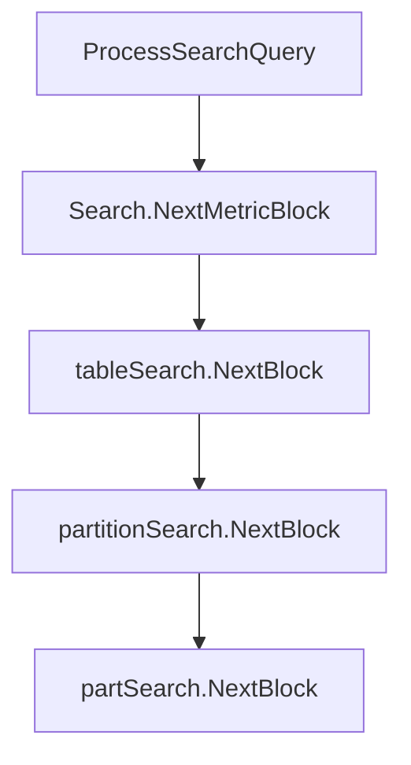
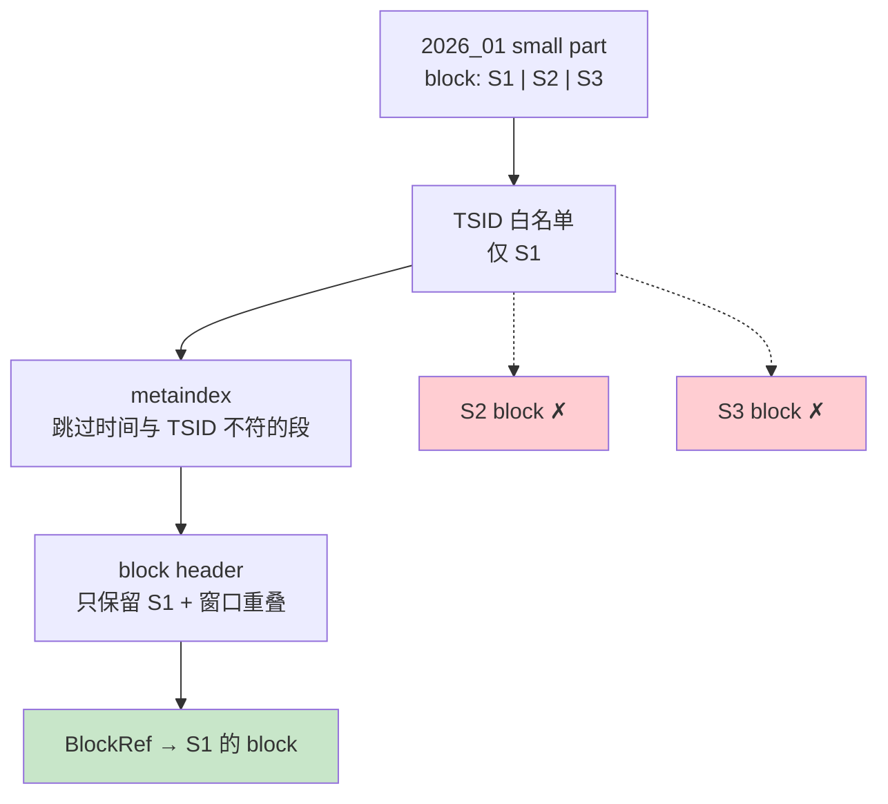

# VictoriaMetrics 查询源码解析（二）：part/block 定位与样本裁剪

> **系列索引**：[README.md](./README.md)  
> **上篇**：[06-query-indexdb-series-pruning.md](./06-query-indexdb-series-pruning.md) — 阶段 2～3：IndexDB 裁 series，输出 TSID 白名单  
> **写入侧对照**：[04-part-block-disk.md](./04-part-block-disk.md) — part/block 在磁盘上长什么样  
> **本篇边界**：查询路径的 **阶段 4～5** — TSID 白名单确定之后，如何在样本 part 里**定位 block**，再**裁掉窗口外的样本点**。  
> 五段裁剪路线图见 [上篇 §1](./06-query-indexdb-series-pruning.md#1-查询裁剪分五段这篇讲哪两段)。

> **图表预览**：见 [系列索引](./README.md#图表预览)。

---

## 1. 查询裁剪分五段：这篇讲哪两段

[上篇](./06-query-indexdb-series-pruning.md) 已经把阶段 0～3 讲完了。IndexDB 的输出是一份 **有序 TSID 列表**——相当于告诉存储引擎：「这次查询只要这几条 series」。

**本篇接 TSID 白名单往下走**，负责两件事：

| 阶段 | 在干什么 | 裁什么 | 本篇 |
|------|----------|--------|------|
| **4** | 在 `small/`/`big/` part 里按 TSID + 时间 **定位 block** | 不相关的 part、metaindex 段、block header | **✅ 核心** |
| **5** | 从磁盘 **读出 block**，按查询窗口 **裁样本点** | 窗口外的 timestamp | **✅ 核心** |


**和 IndexDB 的分界**：阶段 4 之前**不读** `timestamps.bin` / `values.bin`；阶段 4 只决定「读哪些 block」；阶段 5 才真正解压样本并裁点。

---

## 2. 贯穿示例（与上篇相同）

| ID | PromQL | 1 月样本（`2026_01`） |
|----|--------|------------------------|
| **S1** | `cpu_usage{host="h1",job="api"}` | #1 `0.72` 10:00；#2 `0.75` 10:01 |
| **S2** | `cpu_usage{host="h2",job="api"}` | #3、#4（10:00、10:02） |
| **S3** | `http_requests_total{host="h1",path="/x"}` | #5、#6 |

上篇查询：

```promql
cpu_usage{host="h1"}
```

时间范围：`2026-01-15 10:00:00` ~ `2026-01-15 10:05:00`（UTC）。

**上篇结束时**：IndexDB 已裁掉 S2、S3，只剩 **S1 的 TSID**。  
**本篇要说明**：磁盘 part 里可能仍有 S2/S3 的 block，但阶段 4 **根本不会去碰它们**；S1 的 block 读出来后，阶段 5 再裁掉不在 10:00～10:05 内的点（若有）。

写入落盘后，`2026_01` 的 small part 里大致有 **3 个 block**（S1/S2/S3 各一，见 [第 4 篇](./04-part-block-disk.md)）。查询时只会打开 **S1 那一个**。

---

## 3. 本篇要回答的问题

| 问题 | 本篇是否覆盖 |
|------|----------------|
| TSID 白名单怎么用在 part 搜索里？ | ✅ |
| metaindex / block header 如何跳过无关 block？ | ✅ |
| 为何 block 读了还要 `filterTimestamps`？ | ✅ |
| S2/S3 的 block 会不会被读？ | ✅ |
| IndexDB 怎么筛 series？ | ❌ [上篇](./06-query-indexdb-series-pruning.md) |

---

## 4. 从 TSID 白名单到 `NextMetricBlock`

上篇在 `Search.Init` 里完成 IndexDB 搜索并初始化 `tableSearch`：

```171:177:lib/storage/search.go
	tsids, err := storage.SearchTSIDs(qt, tfss, tr, maxMetrics, deadline)
	s.ts.Init(storage.tb, tsids, tr)
	qt.Printf("search for parts with data for %d series", len(tsids))
```

`ProcessSearchQuery` 随后循环取 block：

```1176:1183:app/vmselect/netstorage/netstorage.go
	for sr.NextMetricBlock() {
		blocksRead++
		// ...
		br := sr.MetricBlockRef.BlockRef
```

调用链可以记成：



每一层都在做**更细的定位**；阶段 4 的核心逻辑在 `partSearch` 里。

---

## 5. 阶段 4：在 part 里定位要读的 block

> **阶段 4 做什么**：拿着 TSID 白名单 + `TimeRange`，在样本 part 的 **metaindex → block header** 上逐层跳过，最后得到若干 `BlockRef`（指向 `timestamps.bin` / `values.bin` 的偏移）。**此时尚未读样本值。**

### 5.1 tableSearch：遍历 partition

`tableSearch.Init` 对**每个 partition** 初始化一个 `partitionSearch`：

```85:91:lib/storage/table_search.go
	ts.ptws = tb.GetAllPartitions(ts.ptws[:0])
	for i, ptw := range ts.ptws {
		ts.ptsPool[i].Init(ptw.pt, tsids, tr)
	}
```

对我们的查询，上篇阶段 1 已限定在 `2026_01`；`2026_02` 虽存在（S1 的 #7），但时间窗口不重叠，`partitionSearch` 会直接跳过：

```78:82:lib/storage/partition_search.go
	if !pt.tr.overlapsWith(tr) {
		pts.err = io.EOF
		return
	}
```

### 5.2 partitionSearch：遍历 part，传入 TSID 白名单

每个 partition 内的 **small/big part** 各起一个 `partSearch`，**同一份 TSID 列表**传下去：

```101:107:lib/storage/partition_search.go
	pts.pws = pt.GetParts(pts.pws[:0], true)
	for i, pw := range pts.pws {
		pts.psPool[i].Init(pw.p, filteredTSIDs, tr)
	}
```

`2026_01` 的 part 里虽有 S1/S2/S3 三个 block，但 `partSearch` 只会在白名单 **TSID(S1)** 上前进——S2、S3 的 block header 会被 TSID 比较逻辑跳过（见下）。

### 5.3 partSearch：三层跳过

两层索引的结构与字段含义见 [第 4 篇 §6.2](./04-part-block-disk.md#62-两层索引metaindex-粗筛--index-精定位)（含 **`2026_01` part 的真实 offset / MetricID 示例**）：`metaindex.bin` 粗筛 index block，`index.bin` 内 blockHeader 精定位到 timestamps/values。下面按**查询执行顺序**说明三层跳过逻辑。

**读盘顺序**：`metaindex.bin`（已在内存）→ 按需 `ReadAt` **`index.bin`** → block header → 数据文件。

**（1）part 级：时间范围**

```68:74:lib/storage/part_search.go
	if p.ph.MinTimestamp <= tr.MaxTimestamp && p.ph.MaxTimestamp >= tr.MinTimestamp {
		ps.tsids = tsids
	}
```

整个 part 与查询窗口无交集则不做任何扫描。

**（2）metaindex 级：按 TSID 与时间跳过段**

```167:174:lib/storage/part_search.go
		if mr.MaxTimestamp < ps.tr.MinTimestamp {
			continue
		}
		if mr.MinTimestamp > ps.tr.MaxTimestamp {
			continue
		}
```

metaindex 每一行覆盖一段 TSID 范围和时间范围；太旧或太新的整段直接 `continue`。

同时 `skipTSIDsSmallerThan` 用**二分**在白名单 TSID 上跳转，避免线性扫完 S2、S3 的 metaindex 段。

**（3）block header 级：TSID + 时间双重匹配**

在 index block 内的 block header 列表上：

```286:302:lib/storage/part_search.go
		if bh.MaxTimestamp < ps.tr.MinTimestamp {
			bhs = bhs[1:]
			continue
		}
		if bh.MinTimestamp > ps.tr.MaxTimestamp {
			if !ps.nextTSID() {
				return false
			}
			continue
		}
		ps.BlockRef.init(ps.p, bh)
```

- header 的 TSID **≠ 当前白名单 TSID** → 换下一个 TSID（S2/S3 的 header 在这里被跳过）
- header 时间与窗口无交集 → 跳过该 header
- 都匹配 → 得到 `BlockRef`，交给 `Search.NextMetricBlock`

### 5.4 示例：为何 S2/S3 的 block 不会被读



`Search.NextMetricBlock` 还会在返回前解析 metricName，并跳过超出 retention 的 block（与阶段 4 同类，属于保护性裁剪）：

```217:220:lib/storage/search.go
			if s.ts.BlockRef.bh.MaxTimestamp < s.retentionDeadline {
				continue
			}
```

---

## 6. 阶段 5：读 block 并按窗口裁样本点

> **阶段 5 做什么**：对阶段 4 得到的每个 `BlockRef`，从磁盘读出压缩 block，解压后在内存里**只保留落在 `TimeRange` 内的 timestamp**。

### 6.1 ProcessSearchQuery：先登记 block，稍后解压

`NextMetricBlock` 返回后，`ProcessSearchQuery` 把 `BlockRef` 序列化进临时文件（同一 series 的多个 block 会归在一起），**此步仍不裁样本点**：

```1197:1203:app/vmselect/netstorage/netstorage.go
		buf = br.Marshal(buf[:0])
		addr, err := tbf.WriteBlockRefData(buf)
```

注意：`-search.maxSamplesPerQuery` 在这里按 **block 行数**累计（`br.RowsCount()`），因为后面解压时仍要处理整个 block 的 CPU 成本——即使阶段 5 会裁掉部分点。

### 6.2 unpackFrom：读盘 + filterTimestamps

PromQL rollup 消费数据时，通过 `sortBlock.unpackFrom` 真正读 block：

```677:686:app/vmselect/netstorage/netstorage.go
	brReal.MustReadBlock(tmpBlock)
	if err := tmpBlock.UnmarshalData(); err != nil {
		return fmt.Errorf("cannot unmarshal block: %w", err)
	}
	sb.Timestamps, sb.Values = tmpBlock.AppendRowsWithTimeRangeFilter(sb.Timestamps[:0], sb.Values[:0], tr)
	skippedRows := tmpBlock.RowsCount() - len(sb.Timestamps)
```

`MustReadBlock` 按 header 里的偏移读 `timestamps.bin` / `values.bin`（见 [第 4 篇](./04-part-block-disk.md)）。  
**裁剪**发生在 `AppendRowsWithTimeRangeFilter`：

```331:349:lib/storage/block.go
	// Skip timestamps smaller than tr.MinTimestamp.
	for i < len(timestamps) && timestamps[i] < tr.MinTimestamp {
		i++
	}
	// Skip timestamps bigger than tr.MaxTimestamp.
	for j > i && timestamps[j-1] > tr.MaxTimestamp {
		j--
	}
	return timestamps[i:j], b.values[i:j]
```

### 6.3 示例：S1 的两个点如何留下

假设 S1 的 block 里存了 #1、#2 两个点（10:00、10:01），查询窗口 10:00～10:05：

| timestamp | 在窗口内？ | 阶段 5 |
|-----------|------------|--------|
| 10:00 · 0.72 | ✅ | 保留 |
| 10:01 · 0.75 | ✅ | 保留 |

若 block 里还缓存了写入时多带的一个边界点（或 merge 后略扩的时间范围），只要 timestamp 落在 `[MinTimestamp, MaxTimestamp]` 外，就会在 `filterTimestamps` 里被裁掉——**无需再读其他 block**。


---

## 7. 阶段 4 + 5 串起来：一次查询的完整数据路径

```mermaid
flowchart TB
  Q["cpu_usage{host=\"h1\"}\n10:00~10:05"]
  IDB["上篇 ②③\nTSIDs = [S1]"]
  P4["本篇 ④\npartSearch → S1 BlockRef"]
  P5["本篇 ⑤\n读 block + 裁点"]
  ROLL["PromQL rollup\nrate / avg …"]

  Q --> IDB --> P4 --> P5 --> ROLL

  DISK2["S2/S3 block\n④ 不定位"]
  IDB -.-> DISK2
```

| 步骤 | 裁掉了什么 | 还没裁什么 |
|------|------------|------------|
| ②③ IndexDB | S2、S3 整条 series | — |
| ④ partSearch | S2/S3 的 block；时间不对的 metaindex/header | block 内可能仍含窗口外点 |
| ⑤ filterTimestamps | 窗口外的 timestamp | — |

---

## 8. 和写入路径的对称关系

| | 写入（[第 4 篇](./04-part-block-disk.md)） | 查询（本篇） |
|--|-------------------------------------------|--------------|
| 单位 | rawRow → flush → **block** 写入 part | **BlockRef** 定位 → 读 block |
| 索引 | part 内 `metaindex.bin` + `index.bin` | 同一套文件，反向定位 |
| 数据文件 | `timestamps.bin` / `values.bin` | `MustReadBlock` 读取 |
| 裁剪 | 无（全量写入） | TSID 白名单 + 时间窗口 |

写入时 block 按 TSID 排序追加；查询时 `partSearch` 依赖**有序 TSID 白名单**做二分跳转——这是上篇阶段 3 必须 `sort.Slice(tsids)` 的原因之一。

---

## 9. 小结（阶段 4 + 5）

| 阶段 | 一句话 | 输入 | 输出 | 裁掉了什么 |
|------|--------|------|------|------------|
| **4** | 在 part 里定位 block | TSID 白名单 + TimeRange | `BlockRef` 列表 | 无关 partition/part/block（S2/S3） |
| **5** | 读 block 并裁样本 | `BlockRef` + TimeRange | 窗口内的 timestamps/values | 窗口外的点 |

五段裁剪至此收束：

1. **IndexDB（②③）** 决定「查哪几条 series」  
2. **part 搜索（④）** 决定「读哪些 block」  
3. **样本过滤（⑤）** 决定「block 里哪些点参与计算」

---

## 10. 源码阅读清单

| 顺序 | 文件 | 关注函数 |
|------|------|----------|
| 1 | `app/vmselect/netstorage/netstorage.go` | `ProcessSearchQuery` — 循环 `NextMetricBlock`；`unpackFrom` — 阶段 5 |
| 2 | `lib/storage/search.go` | `Search.Init`、`NextMetricBlock` |
| 3 | `lib/storage/table_search.go` | `tableSearch.Init`、`NextBlock` |
| 4 | `lib/storage/partition_search.go` | `partitionSearch.Init` |
| 5 | `lib/storage/part_search.go` | `partSearch.Init`、`nextBHS`、`searchBHS` |
| 6 | `lib/storage/block.go` | `MustReadBlock`（在 `BlockRef` 上）、`AppendRowsWithTimeRangeFilter`、`filterTimestamps` |

---

## 11. 系列导航

- **上篇**：[06-query-indexdb-series-pruning.md](./06-query-indexdb-series-pruning.md) — IndexDB 裁 series（阶段 2～3）  
- **写入 part**：[04-part-block-disk.md](./04-part-block-disk.md) — block/part 文件格式  
- **写入 IndexDB**：[05-indexdb-write-path.md](./05-indexdb-write-path.md) — IndexDB 键空间  

两篇合起来，就是 PromQL 查询在 VictoriaMetrics 存储层「**从 label 到样本点**」的完整裁剪路径。
