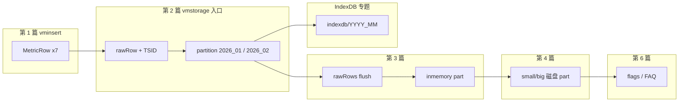

# VictoriaMetrics 写入路径源码解析（系列索引）

> 以 Prometheus **remote write** 为主线，用**同一批示例数据**贯穿全系列：图文并茂、模块边界清晰、论点均有源码依据。

## 贯穿示例（全系列统一）

业务场景：API 服务在 **2026-01-15** 与 **2026-02-03** 上报监控。

### 三条时间序列（series）

| ID | PromQL 形态 | 说明 |
|----|-------------|------|
| **S1** | `cpu_usage{host="h1",job="api"}` | 主机 h1 CPU |
| **S2** | `cpu_usage{host="h2",job="api"}` | 主机 h2 CPU |
| **S3** | `http_requests_total{host="h1",path="/x"}` | h1 某路径请求 counter |

指标名 + **全部** labels 唯一确定一条 series → 在 vmstorage 中对应**一个** `TSID.MetricID`（见 [第 2 篇](./02-vmstorage-addrows-tsid.md)）。

### 七个样本点（一次或多次 remote write）

| # | Series | 时间（UTC） | 时间戳（ms） | 值 | partition（vmstorage） |
|---|--------|-------------|--------------|-----|------------------------|
| 1 | S1 | 2026-01-15 10:00:00 | `1736935200000` | `0.72` | `2026_01` |
| 2 | S1 | 2026-01-15 10:01:00 | `1736935260000` | `0.75` | `2026_01` |
| 3 | S2 | 2026-01-15 10:00:00 | `1736935200000` | `0.81` | `2026_01` |
| 4 | S2 | 2026-01-15 10:02:00 | `1736935320000` | `0.79` | `2026_01` |
| 5 | S3 | 2026-01-15 10:00:00 | `1736935200000` | `1200` | `2026_01` |
| 6 | S3 | 2026-01-15 10:01:30 | `1736935290000` | `1248` | `2026_01` |
| 7 | S1 | **2026-02-03** 08:00:00 | `1738569600000` | `0.65` | **`2026_02`** |

**跨月要点**：#7 与 #1/#2 是**同一条 series（S1）**，但时间戳落在 2 月 → 样本进入 **`2026_02` partition**；TSID 仍与 S1 相同（同一 `MetricNameRaw`）。

### 模块边界速览

---

## 文章目录

| 篇 | 文件 | 状态 | 边界（读代码范围） |
|----|------|------|-------------------|
| **1** | [01-vminsert-remote-write.md](./01-vminsert-remote-write.md) | ✅ 已写 | HTTP → `vmstorage.AddRows([]MetricRow)` |
| **2** | [02-vmstorage-addrows-tsid.md](./02-vmstorage-addrows-tsid.md) | ✅ 已写 | `AddRows` → `Storage.add` → TSID / IndexDB → `partition.AddRows` → **rawRows 内存** |
| **3** | [03-rawrows-flush-inmemory-part.md](./03-rawrows-flush-inmemory-part.md) | ✅ 已写 | `rawRowsShards` → inmemory part（内存） |
| **4** | [04-part-block-disk.md](./04-part-block-disk.md) | ✅ 已写 | inmemory → `small/`/`big/`、block、parts.json |
| **专题** | [05-indexdb-write-path.md](./05-indexdb-write-path.md) | ✅ 已写 | IndexDB 写入链路、存什么、与 part 分界 |
| 6 | *（待写）* 写入参数与 FAQ | 计划 | flags、并发、常见误区 |

### 推荐阅读顺序

1. [系列索引](./README.md)（本文）— 记住 3 条 series、7 个点、跨月 #7。  
2. [第 1 篇](./01-vminsert-remote-write.md) — `MetricRow` 如何产生。  
3. [第 2 篇](./02-vmstorage-addrows-tsid.md) — TSID 与 partition 路由。  
4. [第 3 篇](./03-rawrows-flush-inmemory-part.md) — rawRows flush 与 inmemory part。  
5. [第 4 篇](./04-part-block-disk.md) — 磁盘 part、block、parts.json。  
6. [IndexDB 专题](./05-indexdb-write-path.md) — series 索引与样本存储分界（可与第 2 篇对照）。  
7. 对照源码：`index_db.go` + `storage.go` `add()`；样本侧 `partition.go` / `block.go`。

### 图表预览

文中 Mermaid 图在 **GitHub** 或安装 VS Code 扩展 [Markdown Preview Mermaid Support](https://marketplace.visualstudio.com/items?itemName=bierner.markdown-mermaid) 后可预览。

---

## 源码地图（按层）

| 层 | 路径 | 写入路径职责 |
|----|------|--------------|
| 接入 | `app/vminsert/` | 协议、relabel、`MetricRow` |
| 进程 API | `app/vmstorage/main.go` | `AddRows` 包装、只读检查 |
| 存储引擎 | `lib/storage/` | TSID、partition、IndexDB、rawRows、part |
| 索引 | `lib/storage/index_db.go` | series 元数据、tag 倒排（非样本值） |
| 协议模型 | `lib/prompb/` | remote write 结构体 |
